# LESSON 01: SET UP AND CREATE NEW PROJECTS IN KEILC
<details><summary>Chi tiết</summary>
<p>

</p>
</details>


# LESSON 2: GPIO

<details><summary>Chi tiết</summary>
<p>

## 1. Thư viện STM32F10x SPL (Standard Peripherals Library)
## 2.  Lý thuyết về GPIO
GPIO-General Purpose Input/Output là các chân trên vi điều khiển có thể lập trình để truyền nhận tín hiệu với các thiết bị bên ngoài hoặc thực hiện các chức năng giao tiếp khác.   
### Lập trình với GPIO:
Cấu hình, điều khiển các ngoại vi sử dụng thư viện SPL (Standard Peripheral Firmware Library). Thư viện SPL cung cấp các hàm và các định nghĩa giúp việc cấu hình và sử dụng ngoại vi dễ dàng và rõ ràng. Ở trong thư viện này, các cấu hình được chia thành các trường và định nghĩa bằng các cấu trúc như struct và enum
#### Cấp xung clock cho GPIO
Trong SPL, để bật xung clock cho ngoại vi GPIO
```c
void RCC_Config(){
	RCC_APB2PeriphClockCmd(RCC_APB2Periph_GPIOC, ENABLE);
} 
```
- Tham số thứ 1 là ngoại vi cần cấu hình clock
- Tham số thứ 2 là giá trị quy định cấp (ENABLE) hay ngưng (DISABLE) xung clock cho ngoại vi đó

#### Cấu hình GPIO:
```c
void GPIO_Config(){
	GPIO_InitTypeDef GPIO_InitStructure;
	GPIO_InitStructure.GPIO_Pin = GPIO_Pin_13 | GPIO_Pin_14;
	GPIO_InitStructure.GPIO_Mode = GPIO_Mode_Out_PP;
	GPIO_InitStructure.GPIO_Speed = GPIO_Speed_50MHz;
	
	GPIO_Init(GPIOC, &GPIO_InitStructure);
}
```
Việc cấu hình GPIO được thực hiện thông qua việc khai báo và sử dụng struct `GPIO_InitTypeDef`, trong đó chứa các tham số cấu hình cho một chân GPIO cụ thể:
- **GPIO_Pin**: Xác định chân hoặc các chân GPIO muốn cấu hình bằng cách sử dụng các macro như `GPIO_Pin_0`, `GPIO_Pin_1`,... hoặc kết hợp các chân bằng toán tử OR `|` nếu muốn cấu hình nhiều chân cùng lúc
```c
#define GPIO_Pin_0                ((uint16_t)0x0001)  /*!< Pin 0 selected */
#define GPIO_Pin_1                ((uint16_t)0x0002)  /*!< Pin 1 selected */
#define GPIO_Pin_2                ((uint16_t)0x0004)  /*!< Pin 2 selected */
#define GPIO_Pin_3                ((uint16_t)0x0008)  /*!< Pin 3 selected */
#define GPIO_Pin_4                ((uint16_t)0x0010)  /*!< Pin 4 selected */
#define GPIO_Pin_5                ((uint16_t)0x0020)  /*!< Pin 5 selected */
#define GPIO_Pin_6                ((uint16_t)0x0040)  /*!< Pin 6 selected */
#define GPIO_Pin_7                ((uint16_t)0x0080)  /*!< Pin 7 selected */
#define GPIO_Pin_8                ((uint16_t)0x0100)  /*!< Pin 8 selected */
#define GPIO_Pin_9                ((uint16_t)0x0200)  /*!< Pin 9 selected */
#define GPIO_Pin_10               ((uint16_t)0x0400)  /*!< Pin 10 selected */
#define GPIO_Pin_11               ((uint16_t)0x0800)  /*!< Pin 11 selected */
#define GPIO_Pin_12               ((uint16_t)0x1000)  /*!< Pin 12 selected */
#define GPIO_Pin_13               ((uint16_t)0x2000)  /*!< Pin 13 selected */
#define GPIO_Pin_14               ((uint16_t)0x4000)  /*!< Pin 14 selected */
#define GPIO_Pin_15               ((uint16_t)0x8000)  /*!< Pin 15 selected */
#define GPIO_Pin_All              ((uint16_t)0xFFFF)  /*!< All pins selected */
```
- **GPIO_Mode**: Xác định mode hoạt động của chân GPIO
```c
typedef enum
{
    GPIO_Mode_AIN        = 0x0,
    GPIO_Mode_IN_FLOATING = 0x04,
    GPIO_Mode_IPD        = 0x28,
    GPIO_Mode_IPU        = 0x48,
    GPIO_Mode_Out_OD     = 0x14,
    GPIO_Mode_Out_PP     = 0x10,
    GPIO_Mode_AF_OD      = 0x1C,
    GPIO_Mode_AF_PP      = 0x18
} GPIOMode_TypeDef;
```
- **GPIO_Speed**: Chọn tốc độ đáp ứng của chân GPIO
```c
typedef enum
{
    GPIO_Speed_10MHz = 1,
    GPIO_Speed_2MHz,
    GPIO_Speed_50MHz
} GPIOSpeed_TypeDef;
```
Hàm khởi tạo GPIO_Init() nhận 2 tham số:
- **GPIO_TypeDef**: Chỉ định cổng GPIO muốn cấu hình (ví dụ: `GPIOA`, `GPIOB`, `GPIOC`,...).
- **&GPIO_InitStruct**: Con trỏ đến biến cấu trúc `GPIO_InitTypeDef` chứa các thông số cấu hình
#### Sử dụng GPIO
**Một số hàm thao tác với GPIO:**

- Đọc giá trị mức logic (0 hoặc 1) của một chân Input/Output cụ thể trên cổng GPIO
```c
uint8_t GPIO_ReadInputDataBit(GPIO_TypeDef* GPIOx, uint16_t GPIO_Pin);
uint8_t GPIO_ReadOutputDataBit(GPIO_TypeDef* GPIOx, uint16_t GPIO_Pin);
```
- Đọc toàn bộ giá trị đầu vào/ra của một cổng GPIO

*Giá trị trả về 16-bit, mỗi bit tương ứng với trạng thái của từng chân của cổng*
```c
uint16_t GPIO_ReadInputData(GPIO_TypeDef* GPIOx);
uint16_t GPIO_ReadOutputData(GPIO_TypeDef* GPIOx);
```
- Cho giá trị điện áp Đặt mức cao (1) / thấp (0) cho một hoặc nhiều chân output sử dụng OR `|` trên một cổng GPIO
```c
void GPIO_SetBits(GPIO_TypeDef* GPIOx, uint16_t GPIO_Pin);
void GPIO_ResetBits(GPIO_TypeDef* GPIOx, uint16_t GPIO_Pin);
```
- Ghi mức logic cụ thể (0 hoặc 1) cho một chân output
```c
void GPIO_WriteBit(GPIO_TypeDef* GPIOx, uint16_t GPIO_Pin, BitAction BitVal);
```
- Ghi một giá trị 16-bit trực tiếp cho toàn bộ cổng GPIO, trong đó mỗi bit đại diện cho trạng thái của một chân
```c
void GPIO_Write(GPIO_TypeDef* GPIOx, uint16_t PortVal);
```
</p>
</details>

# LESSON 3: INTERRUPTS AND TIMER

<details><summary>Chi tiết</summary>
<p>

## 1. Ngắt

Ngắt là một cơ chế cho phép hệ thống tạm ngừng chương trình đang thực hiện để xử lý một sự kiện ưu tiên cao hơn, sau đó quay lại hoàn thành công việc còn dở.

Khi một ngắt xảy ra, vi điều khiển sẽ lưu lại trạng thái hiện tại và chuyển tới hàm phục vụ ngắt (ISR - Interrupt Service Routine).

Có 3 loại ngắt chính: Ngắt ngoài, ngắt timer, ngắt truyền thông

### Vector table
Vector table là một vùng trong bộ nhớ của vi điều khiển, chứa các địa chỉ của các hàm phục vụ ngắt tương ứng với từng ngắt

### Độ ưu tiên ngắt
Mỗi ngăt có độ ưu tiên khác nhau. Khi nhiều ngắt xảy ra, độ ưu tiên sẽ quyết định ngắt nào sẽ được thực thi trước.

STM32 quy định ngắt nào có số ưu tiên càng thấp thì có quyền càng cao. Các ưu tiên ngắt có thể lập trình được.

### Ngắt ngoài
Xảy ra khi có thay đổi điện áp trên các chân GPIO được cấu hình làm ngõ vào ngắt.

- LOW: kích hoạt ngắt liên tục khi chân ở mức thấp.

- HIGH: Kích hoạt liên tục khi chân ở mức cao.

- Rising: Kích hoạt khi trạng thái trên chân chuyển từ thấp lên cao.

- Falling: Kích hoạt khi trạng thái trên chân chuyển từ cao xuống thấp.
### Ngắt timer
Ngắt Timer xảy ra khi giá trị trong thanh ghi đếm của timer tràn. Giá trị tràn được xác định bởi giá trị cụ thể trong thanh ghi đếm của timer.

Vì đây là ngắt nội trong MCU, nên phải reset giá trị thanh ghi timer để có thể tạo được ngắt tiếp theo

### Ngắt truyền thông
Ngắt truyền thông xảy ra khi có sự kiện truyền/nhận dữ liệu giữa MCU với các thiết bị bên ngoài hay với MCU.

Ngắt này sử dụng cho nhiều phương thức như Uart, SPI, I2C…v.v nhằm đảm bảo việc truyền nhận chính xác

## Timer
Có thể hiểu 1 cách đơn giản: timer là 1 mạch digital logic có vai trò đếm mỗi chu kỳ clock (đếm lên hoặc đếm xuống).

Timer còn có thể hoạt động ở chế độ nhận xung clock từ các tín hiệu ngoài. Có thể là từ 1 nút nhấn, bộ đếm sẽ được tăng sau mỗi lần bấm nút (sườn lên hoặc sườn xuống tùy vào cấu hình). Ngoài ra còn các chế độ khác như PWM, định thời …vv.

STM32F103 có 7 Timer

### Cấu hình timer
- `TIM_ClockDivision`: Hệ số chia xung nhịp cho bộ lọc trong các chế độ Input Capture/Output Compare. Tham số này không ảnh hưởng đến tần số đếm của Timer.

- `TIM_Prescaler`: Dùng để chia tần số xung nhịp đầu vào cho Timer (tần số từ bus APB) trước khi cấp cho bộ đếm, điều chỉnh tốc độ đếm của Timer.

- `TIM_Period`: Giá trị tối đa mà bộ đếm sẽ đạt tới trước khi tràn và quay về đếm lại từ 0.

- `TIM_CounterMode`: Chế độ đếm.

- `TIM_CounterMode_Up`, `TIM_CounterMode_Down`: Đếm lên/xuống.

- `TIM_CounterMode_CenterAligned1,...`: Đếm ở giữa dùng cho PWM

Cấu hình mẫu cho timer và delay ms:
```c 
TIM_Config
{
    // Clock - Nguồn APB2: 72MHz
    RCC_APB1PeriphClockCmd(RCC_APB1Periph_TIM2, ENABLE);

    // Config parameters
    TIM_TimeBaseInitTypeDef TIM_TimeBaseInitStruct;

    TIM_TimeBaseInitStruct.TIM_ClockDivision = TIM_CKD_DIV1;     // Clock division (chỉ áp dụng cho bộ lọc Input Capture/Output Compare)
    TIM_TimeBaseInitStruct.TIM_Prescaler = 7200 - 1;             // Prescaler: 72 MHz / 7200 = 10 kHz (tần số thực tế của Timer, tần số đếm)
    TIM_TimeBaseInitStruct.TIM_Period = 0xFFFF;                  // Period: Đếm từ 0 đến 0xFFFF (65535), sau đó sẽ tràn

    // Chu kì timer/chu kì 1 lần đếm cho period từ 0->1: 1/10kHz = 0.1 ms

    TIM_TimeBaseInitStruct.TIM_CounterMode = TIM_CounterMode_Up; 

    // Enable TIM2
    TIM_TimeBaseInit(TIM2, &TIM_TimeBaseInitStruct);
    TIM_Cmd(TIM2, ENABLE);
}

void Delay_ms(uint16_t time_ms) 
{
    // Reset the Timer 2 counter
    TIM_SetCounter(TIM2, 0);

    // Calculate the required ticks
    uint16_t ticks = time_ms * 10; // With Timer frequency at 10 kHz, each tick equals 1 ms

    // Wait until the counter reaches the required ticks
    while (TIM_GetCounter(TIM2) < ticks);
}
```
</p>
</details>

# LESSON 04: BASIC COMMUNICATION PROTOCOLS
<details><summary>Chi tiết</summary>
<p>

## 1. SPI - Serial Peripheral Interface
### Đặc điểm và cấu trúc vật lý

.png)
SPI là chuẩn giao tiếp nối tiếp, đồng bộ, cấu trúc Master - Slave, song công

Bốn chân giao tiếp gồm:

- SCK (Serial Clock): Master tạo xung tín hiệu SCK và cung cấp cho Slave.
- MISO (Master Input Slave Output): Master nhận tín hiệu từ Slave.
- MOSI (Master Output Slave Input): Slave nhận tín hiệu từ Master.
- CS (Chip Select): Chọn Slave cụ thể để giao tiếp bằng cách xuất tín hiệu đường SS tương ứng xuống mức 0 (Low).

### SPI frame và quá trình truyền nhận

.png)

Một frame thông điệp trong SPI thường là 8 bit, gửi MSB trước hoặc LSB trước tùy hệ thống.

- Bắt đầu, master sẽ kéo chân CS của slave muốn giao tiếp xuống 0.

- Clock sẽ được cấp bởi master, tùy vào chế độ hoạt động, với mỗi xungc clock, 1 bit sẽ được truyền từ master đến slave và slave cũng truyền 1 bit cho master.

- Lặp lại quá trình trên đến khi truyền xong 8 bit.

- Kết thúc, master kéo chân CS lên 1
### Chế độ hoạt động
SPI có 4 chế độ hoạt động phụ thuộc vào CPOL - Clock Polarity và CPHA - Clock Phase.

Ý nghĩa của CPOL và CPHA:

- CPOL = 0: Xung clock ở mức thấp (0) khi bus ở trạng thái nghỉ.
- CPOL = 1: Xung clock ở mức cao (1) khi bus ở trạng thái nghỉ.
- CPHA = 0: Bit data được gửi tại cạnh đầu tiên của xung clock.
- CPHA = 1: Bit data được gửi tại cạnh thứ hai của xung clock.

.png)

## 2. I2C - Inter-Integrated Circuit
### Đặc điểm và cấu trúc vật lý
I2C là chuẩn giao tiếp nối tiếp, đồng bộ, cấu trúc Master - Slave, bán song công.

Hai dây giao tiếp gồm:

- SDA (Serial Data Line): Dây truyền dữ liệu.
- SCL (Serial Clock Line) Dây xung clock

.png)

*Điện trở kéo lên: Thường 4.7 kΩ, VCC: Thường là 3.3V hoặc 5V để chống nhiễu*

### I2C frame và quá trình truyền nhận

.png)

Một frame thông điệp của I2C gồm:

- Start: SDA từ 1 xuống 0 trước SCL.

- 7->10 bit địa chỉ + 1 bit 0 hoặc 1 tương ứng với ghi/đọc, gửi MSB trước.

- ACK: Nếu Slave nhận được đúng địa chỉ nó sẽ gửi một bit ACK = 0.

- 8 bit data: Có thể là data do Master gửi (write) hoặc đọc về từ Slave (read), gửi MSB trước.

- Stop: SDA từ 0 lên 1 sau SCL

## 3. UART - Universal Asynchronous Receiver-Transmitter
### Đặc điểm và cấu trúc vật lý

.png)

UART là chuẩn giao tiếp nối tiếp, không đồng bộ, song công.

Hai dây giao tiếp gồm:

- TX (Transmit): Truyền dữ liệu ra.

- RX (Receive): Nhận dữ liệu vào.

Cả hai thiết bị trong giao tiếp UART dùng baud rate khớp nhau để truyền nhận dữ liệu chính xác.

Baud rate là tốc độ truyền dữ liệu được tính bằng số bit trên giây.

Các mức baud rate có sẵn: 9600, 19200, 38400, 57600, ...

Ví dụ: baudrate = 9600 => 1 bit = 0.10467 ms

### UART frame và quá trình truyền nhận

.png)

Một frame UART thông thường bao gồm các thành phần sau:

Start: 1 bit mức 0.

Data bits: 5->9 bits, phổ biến nhất là 8, gửi LSB trước.

Parity bit: 1 bit, kiểm tra lỗi, có thể có hoặc không.

Stop: 1 hoặc 2 bit mức cao

### Kiểm tra chẵn lẻ
#### Kiểm tra chẵn (Even Parity):

- Tổng số bit 1 trong dãy phải là một số chẵn.

- Nếu số bit 1 là chẵn, thì parity bit sẽ là 0.

- Nếu số bit 1 là lẻ, thì parity bit sẽ là 1 (để tổng số bit 1 trở thành chẵn).

#### Kiểm tra lẻ (Odd Parity):

- Tổng số bit 1 trong dãy phải là một số lẻ.

- Nếu số bit 1 là lẻ, thì parity bit sẽ là 0.

- Nếu số bit 1 là chẵn, thì parity bit sẽ là 1 (để tổng số bit 1 trở thành lẻ).

Ví dụ:

.png)

</p>
</details>

# LESSON 05: SPI SOFTWARE & SPI HARDWARE

<details><summary>Chi tiết</summary>
<p>

## SPI Software
SPI Software là tự tự lập trình cách thức giao tiếp bằng cách điều khiển các chân GPIO để tạo ra các tín hiệu SPI, và có thể sử dụng thêm Timer để quản lý nhịp.

Kém linh hoạt và chậm hơn so với SPI Hardware, ít sử dụng
### Xác định và cấu hình chân GPIO

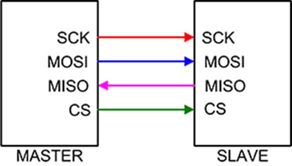

Chọn chân GPIO làm 4 chân SCK, MISO, MOSI, CS
```c 
#define SPI_SCK_Pin  GPIO_Pin_0
#define SPI_MISO_Pin GPIO_Pin_1
#define SPI_MOSI_Pin GPIO_Pin_2
#define SPI_CS_Pin   GPIO_Pin_3
#define SPI_GPIO     GPIOA
#define SPI_RCC      RCC_APB2Periph_GPIOA

void RCC_Config()
{
    // Enable clock for GPIO, Timer 2
    RCC_APB2PeriphClockCmd(SPI_RCC, ENABLE);
    RCC_APB1PeriphClockCmd(RCC_APB1Periph_TIM2, ENABLE);
}
```
Cấu hình chân cho:

- Master: SPI_SCK_Pin, SPI_MOSI_Pin, SPI_CS_Pin là output push-pull, SPI_MISO_Pin là input floating.

- Slave: SPI_SCK_Pin, SPI_MOSI_Pin, SPI_CS_Pin là input floating, SPI_MISO_Pin là output push-pull
```c 
void GPIO_Config()
{
    // Configure for MASTER
    GPIO_InitTypeDef GPIO_InitStructure;

    // Configure SCK, MOSI, and CS as output push-pull
    GPIO_InitStructure.GPIO_Pin = SPI_SCK_Pin | SPI_MOSI_Pin | SPI_CS_Pin;
    GPIO_InitStructure.GPIO_Mode = GPIO_Mode_Out_PP;
    GPIO_InitStructure.GPIO_Speed = GPIO_Speed_50MHz;
    GPIO_Init(SPI_GPIO, &GPIO_InitStructure);

    // Configure MISO as input floating
    GPIO_InitStructure.GPIO_Pin = SPI_MISO_Pin;
    GPIO_InitStructure.GPIO_Mode = GPIO_Mode_IN_FLOATING;
    GPIO_InitStructure.GPIO_Speed = GPIO_Speed_50MHz;
    GPIO_Init(SPI_GPIO, &GPIO_InitStructure);

    
    /*// Configure for SLAVE
    GPIO_InitTypeDef GPIO_InitStructure;

    // Configure SCK, MOSI, and CS as input floating
    GPIO_InitStructure.GPIO_Pin = SPI_SCK_Pin | SPI_MOSI_Pin | SPI_CS_Pin;
    GPIO_InitStructure.GPIO_Mode = GPIO_Mode_IN_FLOATING;
    GPIO_InitStructure.GPIO_Speed = GPIO_Speed_50MHz;
    GPIO_Init(SPI_GPIO, &GPIO_InitStructure);

    // Configure MISO as output push-pull
    GPIO_InitStructure.GPIO_Pin = SPI_MISO_Pin;
    GPIO_InitStructure.GPIO_Mode = GPIO_Mode_Out_PP;
    GPIO_InitStructure.GPIO_Speed = GPIO_Speed_50MHz;
    GPIO_Init(SPI_GPIO, &GPIO_InitStructure);
    */
}
```
### Tạo clock

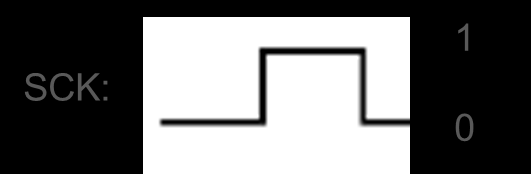

Tín hiệu clock được tạo bằng cách kết hợp kéo chân SCK lên 1, xuống 0 và delay. Delay được tạo bằng timer
```c 
void Clock(){
    GPIO_WriteBit(SPI_GPIO, SPI_SCK_Pin, Bit_SET);
    delay_ms(4);
    GPIO_WriteBit(SPI_GPIO, SPI_SCK_Pin, Bit_RESET);
    delay_ms(4);
}
```
### Set trạng thái ban đầu

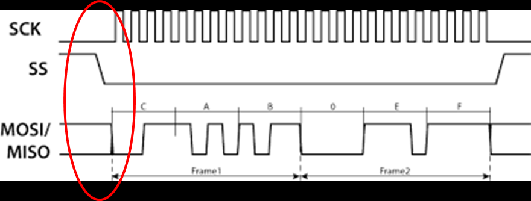

Trạng thái ban đầu: SCK ở mức thấp (tùy mode), CS ở mức cao, MISO và MOSI ở mức nào cũng được
```c 
void SPI_Config()
{
    GPIO_WriteBit(SPI_GPIO, SPI_SCK_Pin, Bit_RESET);
    GPIO_WriteBit(SPI_GPIO, SPI_CS_Pin, Bit_SET);
    GPIO_WriteBit(SPI_GPIO, SPI_MISO_Pin, Bit_RESET);
    GPIO_WriteBit(SPI_GPIO, SPI_MOSI_Pin, Bit_RESET);
}
```
### Hàm truyền
 Hàm truyền sẽ truyền lần lượt 8 bit trong byte dữ liệu:

- Kéo CS xuống 0.

- Truyền 1 bit.

- Dịch 1 bit.

- Gửi clock();

- Kéo CS lên 1;

```c 
void SPI_Master_Transmit(uint8_t u8Data)
{                          // 0b10010000
    uint8_t u8Mask = 0x80; // 0b10000000
    uint8_t tempData;
	
    GPIO_WriteBit(SPI_GPIO, SPI_CS_Pin, Bit_RESET);
    Delay_Ms(1);
	
    for (int i = 0; i < 8; i++)
    {
        tempData = u8Data & u8Mask;
        if (tempData)
        {
            GPIO_WriteBit(SPI_GPIO, SPI_MOSI_Pin, Bit_SET);
            Delay_Ms(1);
        }
        else
        {
            GPIO_WriteBit(SPI_GPIO, SPI_MOSI_Pin, Bit_RESET);
            Delay_Ms(1);
        }
        u8Data = u8Data << 1;
        Clock();
    }
    GPIO_WriteBit(SPI_GPIO, SPI_CS_Pin, Bit_SET);
    Delay_Ms(1);
}
```
### Hàm nhận
Hàm truyền sẽ truyền lần lượt 8 bit trong byte dữ liệu:

- Kiểm tra CS ==0?.

- Kiểm tra Clock==1?

- Đọc data trên MOSI, ghi vào biến.

- Dịch 1 bit.

- Kiểm tra CS==1?

```c 
 uint8_t SPI_Slave_Receive(void)
{
    uint8_t dataReceive = 0x00; // 0b11000000
    uint8_t temp = 0x00, i = 0;

    while (GPIO_ReadInputDataBit(SPI_GPIO, SPI_CS_Pin));

    while (!GPIO_ReadInputDataBit(SPI_GPIO, SPI_SCK_Pin));

    for (i = 0; i < 8; i++)
    {
        if (GPIO_ReadInputDataBit(SPI_GPIO, SPI_SCK_Pin))
        {
            while (GPIO_ReadInputDataBit(SPI_GPIO, SPI_SCK_Pin))
			{
                temp = GPIO_ReadInputDataBit(SPI_GPIO, SPI_MOSI_Pin);
			}
            dataReceive = dataReceive << 1;
            dataReceive = dataReceive | temp;
        }
        while (!GPIO_ReadInputDataBit(SPI_GPIO, SPI_SCK_Pin));
    }
    return dataReceive;
}
```
### Truyền và nhận dữ liệu trong main
#### Master truyền:
```c 
uint8_t DataTrans[] = {1,3,9,10,15,19,90};//Data
int main(){
	RCC_Config();
	GPIO_Config();
	TIM_Config();
	SPI_Init();
	while(1){	
		for(int i = 0; i < 7; i++){
			SPI_Master_Transmit(DataTrans[i]);
			delay_ms(1000);
		}
	}
}
```
#### Slave nhận:
```c 
uint8_t Data;

int main()
{
    RCC_Config();
    GPIO_Config();
    TIM_Config();
    SPI_Config();

    while (1)
    {
        if (!(GPIO_ReadInputDataBit(SPI_GPIO, SPI_CS_Pin)))
        {
            for (int i = 0; i < 10; i++)
            {
                Data = SPI_Slave_Receive();
            }
        }
    }
}
```
## SPI Hardware
SPI Hardware là sử dụng trực tiếp module được tích hợp trên vi điều khiển
### Cấu hình chân GPIO và SPI

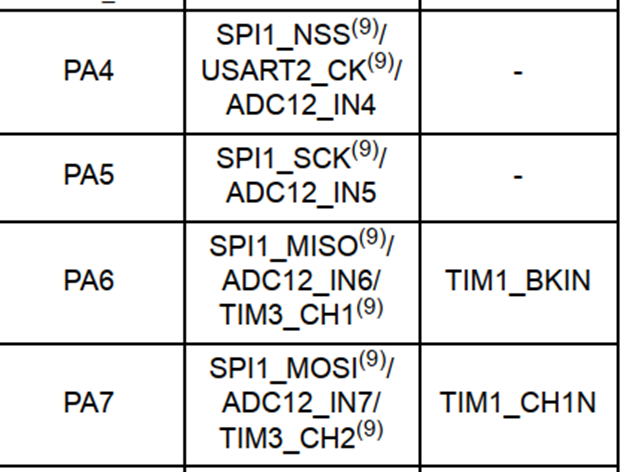

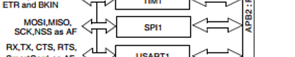

Vì chân của các bộ SPI trên VĐK là cố định nên phải cấu hình đúng chân (Ví dụ dùng SPI1).

Tương tự các ngoại vi khác, các tham số SPI được cấu hình trong `Struct SPI_InitTypeDef`:

-`SPI_Mode`: Quy định chế độ hoạt động của thiết bị SPI.

-`SPI_Direction`: Quy định kiểu truyền của thiết bị.

-`SPI_BaudRatePrescaler`: Hệ số chia clock cấp cho Module SPI.

-`SPI_CPOL`: Cấu hình cực tính của SCK . Có 2 chế độ:

- `S`PI_CPOL_Low`: Cực tính mức 0 khi SCK không truyền xung.

- `SPI_CPOL_High`: Cực tính mức 1 khi SCK không truyền xung.

- `SPI_CPHA`: Cấu hình chế độ hoạt động của SCK. Có 2 chế độ:

- `SPI_CPHA_1Edge`: Tín hiệu truyền đi ở cạnh xung đầu tiên.

- `SPI_CPHA_2Edge`: Tín hiệu truyền đi ở cạnh xung thứ hai.

-`SPI_DataSize`: Cấu hình số bit truyền. 8 hoặc 16 bit.

-`SPI_FirstBit`: Cấu hình chiều truyền của các bit là MSB hay LSB.

-`SPI_CRCPolynomial`: Cấu hình số bit CheckSum cho SPI.

-`SPI_NSS`: Cấu hình chân SS là điều khiển bằng thiết bị hay phần mềm

### Cấu hình cho Master:
Master cấu hình chân MISO, SCK, MOSI là `GPIO_Mode_AF_P` và CS là `GPIO_Mode_Out_PP`
```c 
void RCC_Config(){
	RCC_APB2PeriphClockCmd(RCC_APB2Periph_GPIOA | RCC_APB2Periph_SPI1 , ENABLE);
	RCC_APB1PeriphClockCmd(RCC_APB1Periph_TIM2, ENABLE);
}
void GPIO_Config(){
	GPIO_InitTypeDef GPIO_InitStructure;
	
	GPIO_InitStructure.GPIO_Pin = SPI1_NSS| SPI1_SCK| SPI1_MISO| SPI1_MOSI;
	GPIO_InitStructure.GPIO_Speed = GPIO_Speed_50MHz;
	GPIO_InitStructure.GPIO_Mode = GPIO_Mode_AF_PP;
	GPIO_Init(SPI1_GPIO, &GPIO_InitStructure);
}
void TIM_Config() {
    TIM_TimeBaseInitTypeDef TIM_TimeBaseInitStruct;

    TIM_TimeBaseInitStruct.TIM_ClockDivision = TIM_CKD_DIV2; // Set clock division to 1 (72 MHz / 1 = 72 MHz)
    TIM_TimeBaseInitStruct.TIM_Prescaler = 3600 - 1;        // Set prescaler to 7200-1 (prescales the clock by 7200)
    TIM_TimeBaseInitStruct.TIM_Period = 0xFFFF ;         // Set the auto-reload period to maximum (16-bit timer)
    TIM_TimeBaseInitStruct.TIM_CounterMode = TIM_CounterMode_Up; // Set counter mode to up-counting

    TIM_TimeBaseInit(TIM2, &TIM_TimeBaseInitStruct); // Initialize TIM2 with the configuration
    TIM_Cmd(TIM2, ENABLE);
}
void SPI_Config(){
	SPI_InitTypeDef SPI_InitStructure;
	SPI_InitStructure.SPI_Mode = SPI_Mode_Master;
	SPI_InitStructure.SPI_Direction = SPI_Direction_2Lines_FullDuplex;
	SPI_InitStructure.SPI_BaudRatePrescaler = SPI_BaudRatePrescaler_16;
	SPI_InitStructure.SPI_CPOL = SPI_CPOL_Low;
	SPI_InitStructure.SPI_CPHA = SPI_CPHA_1Edge;
	SPI_InitStructure.SPI_DataSize = SPI_DataSize_8b;
	SPI_InitStructure.SPI_FirstBit = SPI_FirstBit_MSB;
	SPI_InitStructure.SPI_CRCPolynomial = 7;
	SPI_InitStructure.SPI_NSS = SPI_NSS_Soft;
	
	SPI_Init(SPI1, &SPI_InitStructure);
	SPI_Cmd(SPI1, ENABLE);
}
```
### Cấu hình cho Slave

Slave cấu hình chân MISO, SCK, MOSI là `GPIO_Mode_AF_P` và CS là `GPIO_Mode_IN_FLOATING`
```c 
void RCC_Config(){
	RCC_APB2PeriphClockCmd(RCC_APB2Periph_GPIOA | RCC_APB2Periph_SPI1 , ENABLE);
	RCC_APB1PeriphClockCmd(RCC_APB1Periph_TIM2, ENABLE);
}
void GPIO_Config(){
	GPIO_InitTypeDef GPIO_InitStructure;
	
	GPIO_InitStructure.GPIO_Pin = SPI1_NSS | SPI1_SCK | SPI1_MISO | SPI1_MOSI;
	GPIO_InitStructure.GPIO_Speed = GPIO_Speed_50MHz;
	GPIO_InitStructure.GPIO_Mode = GPIO_Mode_AF_PP ;
	GPIO_Init(SPI1_GPIO, &GPIO_InitStructure);
}
void TIM_Config() {
    TIM_TimeBaseInitTypeDef TIM_TimeBaseInitStruct;

    TIM_TimeBaseInitStruct.TIM_ClockDivision = TIM_CKD_DIV2; // Set clock division to 1 (72 MHz / 1 = 72 MHz)
    TIM_TimeBaseInitStruct.TIM_Prescaler = 3600 - 1;        // Set prescaler to 7200-1 (prescales the clock by 7200)
    TIM_TimeBaseInitStruct.TIM_Period = 0xFFFF ;         // Set the auto-reload period to maximum (16-bit timer)
    TIM_TimeBaseInitStruct.TIM_CounterMode = TIM_CounterMode_Up; // Set counter mode to up-counting

    TIM_TimeBaseInit(TIM2, &TIM_TimeBaseInitStruct); // Initialize TIM2 with the configuration
    TIM_Cmd(TIM2, ENABLE);
}
void SPI_Config(){
	SPI_InitTypeDef SPI_InitStructure;
	SPI_InitStructure.SPI_Mode = SPI_Mode_Slave;
	SPI_InitStructure.SPI_Direction = SPI_Direction_2Lines_FullDuplex;
	SPI_InitStructure.SPI_BaudRatePrescaler = SPI_BaudRatePrescaler_16;
	SPI_InitStructure.SPI_CPOL = SPI_CPOL_Low;
	SPI_InitStructure.SPI_CPHA = SPI_CPHA_1Edge;
	SPI_InitStructure.SPI_DataSize = SPI_DataSize_8b;
	SPI_InitStructure.SPI_FirstBit = SPI_FirstBit_MSB;
	SPI_InitStructure.SPI_CRCPolynomial = 7;
	SPI_InitStructure.SPI_NSS = SPI_NSS_Soft;
	
	SPI_Init(SPI1, &SPI_InitStructure);
	SPI_Cmd(SPI1, ENABLE);
}
```
### Master truyền và Slave nhận
#### Master truyền:
```c 
void SPI_Send1Byte(uint8_t data){
		GPIO_ResetBits(GPIOA, SPI1_NSS);
		while(SPI_I2S_GetFlagStatus(SPI1, SPI_I2S_FLAG_TXE) == RESET){}
		SPI_I2S_SendData(SPI1, data);
		while(SPI_I2S_GetFlagStatus(SPI1, SPI_I2S_FLAG_BSY) == SET){}
			GPIO_SetBits(GPIOA, SPI1_NSS);
		}

uint8_t dataSend[] = {3, 1, 10, 19, 20, 36, 90};
int main(){
	RCC_Config();
	GPIO_Config();
	TIM_Config();
	SPI_Config();
	while(1){
		for(int i = 0; i < 7; i++){
			SPI_Send1Byte(dataSend[i]);
			delay_ms(1000);
		}
	}
}
```
#### Slave nhận:
```c
uint8_t SPI_Receive1Byte(void){
    while(SPI_I2S_GetFlagStatus(SPI1, SPI_I2S_FLAG_BSY) == SET);
    uint8_t temp = (uint8_t)SPI_I2S_ReceiveData(SPI1);
    while(SPI_I2S_GetFlagStatus(SPI1, SPI_I2S_FLAG_RXNE) == RESET);
    return temp;
}
uint8_t data;
int main(void){
	RCC_Config();
	GPIO_Config();
	TIM_Config();
	SPI_Config();
	while(1){
		{
			while(GPIO_ReadInputDataBit(GPIOA, SPI1_NSS) == 1){}
			if(GPIO_ReadInputDataBit(GPIOA, SPI1_NSS) == 0) {}
				data = SPI_Receive1Byte();
		}
	}
}
```
</p>
</details>

# LESSON 06: I2C SOFTWARE & I2C HARDWARE

<details><summary>Chi tiết</summary>
<p>

## I2C software
### Cấu hình chân GPIO
```c
#define I2C_SCL GPIO_Pin_6
#define I2C_SDA GPIO_Pin_7
#define I2C_GPIO GPIOB

// Configure GPIO for I2C SDA and SCL pins
void GPIO_Config()
{
	RCC_APB2PeriphClockCmd(RCC_APB2Periph_GPIOB, ENABLE);
	
    GPIO_InitTypeDef GPIO_InitStructure;
    GPIO_InitStructure.GPIO_Mode = GPIO_Mode_Out_OD; // Open-drain mode for I2C
    GPIO_InitStructure.GPIO_Pin = I2C_SDA | I2C_SCL;
    GPIO_InitStructure.GPIO_Speed = GPIO_Speed_50MHz;

    GPIO_Init(I2C_GPIO, &GPIO_InitStructure);
}
```
### Trạng thái ban đầu của SDA, SCK và tín hiệu Start/Stop

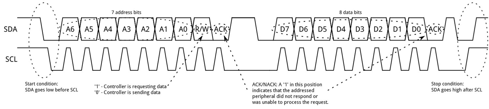

SDA, SCK khi chưa giap tiếp ở trạng thái mức 1.

Tín hiệu Start: SDA xuống 0 sau đó SCL xuống 0.

Tín hiệu Stop: SCL lên 1 sau đó SDA lên 1.

```c
#define WRITE_SDA_0 GPIO_ResetBits(I2C_GPIO, I2C_SDA)
#define WRITE_SDA_1 GPIO_SetBits(I2C_GPIO, I2C_SDA)
#define WRITE_SCL_0 GPIO_ResetBits(I2C_GPIO, I2C_SCL)
#define WRITE_SCL_1 GPIO_SetBits(I2C_GPIO, I2C_SCL)
#define READ_SDA_VAL GPIO_ReadInputDataBit(I2C_GPIO, I2C_SDA)

// Initialize I2C line (set SDA and SCL high)
void I2C_Config()
{
    WRITE_SDA_1;
    Delay_Us(1);
    WRITE_SCL_1;
    Delay_Us(1);
}

// Generate I2C start condition
void I2C_Start()
{
    WRITE_SCL_1;
    Delay_Us(3);
    WRITE_SDA_1;
    Delay_Us(3);
    WRITE_SDA_0; // Pull SDA low before SCL
    Delay_Us(3);
    WRITE_SCL_0;
    Delay_Us(3);
}

// Generate I2C stop condition
void I2C_Stop()
{
    WRITE_SDA_0;
    Delay_Us(3);
    WRITE_SCL_1; // Pull SCL high before SDA
    Delay_Us(3);
    WRITE_SDA_1;
    Delay_Us(3);
}
```
### Hàm truyền và hàm nhận


Hàm truyền này dùng chung cho truyền địa chỉ và truyền data (trong trường hợp master gửi chỉ thị cho slave)

```c
status I2C_Write(uint8_t u8Data){	
	uint8_t i;
	status stRet;
	for(int i=0; i< 8; i++){		//Write byte data.
		if (u8Data & 0x80) {
			WRITE_SDA_1;
		} else {
			WRITE_SDA_0;
		}
		delay_us(3); // make sure SDA high complete
		
		//SCL Clock
		WRITE_SCL_1;
		delay_us(5);
		WRITE_SCL_0;
		delay_us(2);
		// shift 1 bit to the left
		u8Data <<= 1;
	}
	WRITE_SDA_1;					//
	delay_us(3);
	WRITE_SCL_1;					//
	delay_us(3);
	
	if (READ_SDA_VAL) {	
		stRet = NOT_OK;				
	} else {
		stRet = OK;					
	}

	delay_us(2);
	WRITE_SCL_0;
	delay_us(5);
	
	return stRet;
}
```
```c
uint8_t I2C_Read(ACK_Bit _ACK){	
	uint8_t i;		
  status u8set;	
	uint8_t u8Ret = 0x00;
	WRITE_SDA_1;
	delay_us(3);	
	for (i = 0; i < 8; ++i) {
		u8Ret <<= 1;
		
		//SCL Clock
		WRITE_SCL_1;
		delay_us(3);
		if (READ_SDA_VAL) {
			u8Ret |= 0x01;
		}
		delay_us(2);
		WRITE_SCL_0;
		delay_us(5);
	}

	if (_ACK) {	
		WRITE_SDA_0;
	} else {
		WRITE_SDA_1;
	}
	delay_us(3);
	
	WRITE_SCL_1;
	delay_us(5);
	WRITE_SCL_0;
	delay_us(5);

	return u8Ret;
}
```
### Ứng dụng ghi và đọc Eeprom

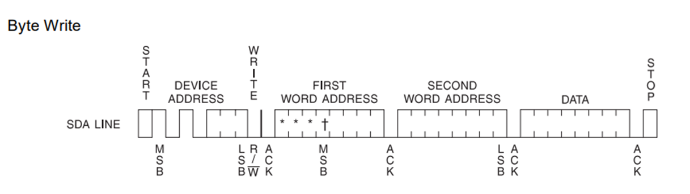

Quá trình ghi:

Start->chờ xem gửi start được không->gửi địa chỉ slave+1 bit write->chờ ACK->gửi 8 bit high thanh ghi cần ghi của Eeprom->chờ ACK->gửi 8 bit low thanh ghi cần ghi của Eeprom->chờ AKC->gửi data cần ghi->chờ ACK->Stop.

#### Hàm ghi vào Eeprom
```c
typedef enum{
	NOT_OK = 0,
	OK = 1
} status;

status EPROM_Write(uint16_t MemAddr, uint8_t SlaveAddress, uint8_t NumByte, uint8_t *u8Data ){
uint8_t i;
    I2C_Start();
		
    if (I2C_Write(SlaveAddress << 1) == NOT_OK) {
        I2C_Stop();
        return NOT_OK;
    }

    if (I2C_Write((MemAddr + i) >> 8) == NOT_OK) {
        I2C_Stop();
        return NOT_OK;
    }

    if (I2C_Write(MemAddr + i) == NOT_OK) {
        I2C_Stop();
        return NOT_OK;
    }
for (i = 0; i < NumByte; ++i) {
    if (I2C_Write(u8Data[i]) == NOT_OK) {
        I2C_Stop();
        return NOT_OK;
    }
	}
    I2C_Stop();
		delay_us(10);

 return OK;
}
```
#### Hàm đọc Eeprom
Theo data sheet thì có nhiều chế độ đọc (Current Address Read, Random Read, Sequential Read)

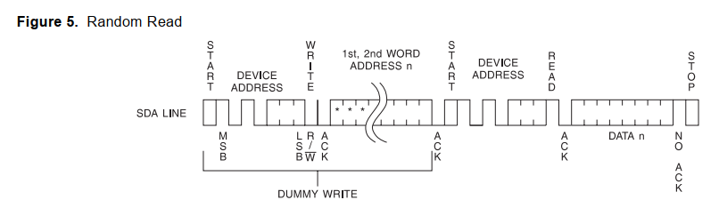

Sau đây là quá trình Random Read nghĩa là đọc giá trị một địa chỉ thanh ghi cụ thể:

Start->chờ xem gửi start được không->gửi địa chỉ slave+1 bit read->chờ ACK->gửi 8 bit high thanh ghi cần đọc của Eeprom->chờ ACK->gửi 8 bit low thanh ghi cần đọc của Eeprom->chờ AKC->đọc data->chờ NACK->Stop.

```c
typedef enum{
	NACK = 0,
	ACK = 1
} ACK_Bit;

status EPROM_Read(uint16_t MemAddr, uint8_t SlaveAddress, uint8_t NumByte, uint8_t *u8Data ){
	uint8_t i;
	I2C_Start();
	if (I2C_Write(SlaveAddress << 1) == NOT_OK) {
		I2C_Stop();
		return NOT_OK;
	}
	if (I2C_Write(MemAddr >> 8) == NOT_OK) {
    I2C_Stop();
    return NOT_OK;
}

if (I2C_Write(MemAddr) == NOT_OK) {
    I2C_Stop();
    return NOT_OK;
}
	I2C_Start();
if (I2C_Write((SlaveAddress << 1) | 1) == NOT_OK) {
    I2C_Stop();
    return NOT_OK;
}

for (i = 0; i < NumByte - 1; ++i) {
    u8Data[i] = I2C_Read(ACK); // Ð?c các byte và g?i ACK cho m?i byte, tr? byte cu?i
}

		u8Data[i] = I2C_Read(NACK); // Ð?c byte cu?i và g?i NACK

I2C_Stop();

return OK;

}
```
### Luồng hoạt động trong main()
```c 
// Khai bao mang du lieu de ghi vao EEPROM
uint8_t Data1[10] = {0x03, 0x05, 0x0E, 0xDA, 0xA6, 0x6F, 0x50, 0x00, 0x00, 0xF0};
uint8_t Data2[10] = {0x19, 0x0A, 0x19, 0x24, 0xFA, 0x10, 0x3C, 0x48, 0x59, 0x77};
uint8_t Rcv[10] = {0x00, 0x00, 0x00, 0x00, 0x00, 0x00, 0x00, 0x00, 0x00, 0x00};

// Ham chinh
int main() {
    // Cau hinh he thong
    RCC_Config();
    TIM2_Config();
    GPIO_Config();
    I2C_Config();

    // Ghi du lieu tu Data1 vao EEPROM tai dia chi 0x0045
    while (EPROM_Write(0x0045, 0x57, 10, Data1) == NOT_OK) {
        // Thu ghi lai neu that bai
    }

    // Them delay giua hai lan truyen
    //Delay_Ms(500); // Them 500 ms delay, co the dieu chinh theo yeu cau

    // Sau khi ghi xong Data1, tiep tuc ghi Data2
    while (EPROM_Write(0x0060, 0x57, 10, Data2) == NOT_OK) {
        // Thu ghi lai neu that bai
    }

    // Doc lai du lieu tu EEPROM de kiem tra
    while (1) {
        // Doc 10 byte tu dia chi 0x0045 vao mang Rcv
        while (EPROM_Read(0x0045, 0x57, 10, Rcv) == NOT_OK) {
            // Thu doc lai neu that bai
        }
        Delay_Ms(500);

        // Doc 10 byte tu dia chi 0x0060 vao mang Rcv
        while (EPROM_Read(0x0060, 0x57, 10, Rcv) == NOT_OK) {
            // Thu doc lai neu that bai
        }

        Delay_Ms(1000); // Doi 1 giay truoc khi doc lai
    }
}

```
## I2C hardware
### Cấu hình tham số I2C Hardware, cấu hình GPIO và reset SDA, SCL về trạng thái chưa gửi
#### Cấu hình tham số I2C Hardware 
Tương tự các ngoại vi khác, các tham số I2C được cấu hình trong Struct `I2C_InitTypeDef`:

- `I2C_Mode`: Cấu hình chế độ hoạt động cho I2C:

- `I2C_Mode_I2C`: Chế độ I2C FM(Fast Mode);

- `I2C_Mode_SMBusDevice&I2C_Mode_SMBusHost`: Chế độ SM(Slow Mode). `I2C_ClockSpeed`: Cấu hình clock cho I2C, tối đa 100khz với SM và 400khz ở FM.

- `I2C_DutyCycle`: Cấu hình chu kì nhiệm vụ của xung:

   + `I2C_DutyCycle_2`: Thời gian xung thấp/ xung cao =2;

   + `I2C_DutyCycle_16_9`: Thời gian xung thấp/ xung cao =16/9

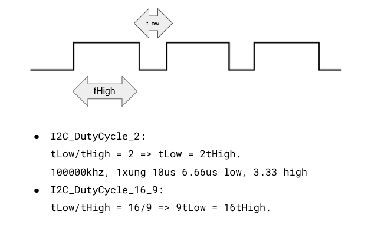

- `I2C_OwnAddress1`: Cấu hình địa chỉ thieets bij dang caau hinh.

- `I2C_Ack`: Cấu hình ACK, có sử dụng ACK hay không.

- `I2C_AcknowledgedAddress`: Cấu hình số bit địa chỉ. 7 hoặc 10 bit
```c
void I2C_Config(void) {
    GPIO_InitTypeDef GPIO_InitStructure;
    I2C_InitTypeDef I2C_InitStructure;

    // Bat clock cho I2C va GPIO
    RCC_APB1PeriphClockCmd(EEPROM_I2C_RCC, ENABLE);
    RCC_APB2PeriphClockCmd(EEPROM_GPIO_RCC, ENABLE);

    // Cau hinh chan I2C SDA va SCL
    GPIO_InitStructure.GPIO_Pin = EEPROM_SCL | EEPROM_SDA;
    GPIO_InitStructure.GPIO_Speed = GPIO_Speed_50MHz;
    GPIO_InitStructure.GPIO_Mode = GPIO_Mode_AF_OD;
    GPIO_Init(EEPROM_GPIO, &GPIO_InitStructure);

    // Cau hinh I2C
    I2C_InitStructure.I2C_Mode = I2C_Mode_I2C;
    I2C_InitStructure.I2C_DutyCycle = I2C_DutyCycle_2;
    I2C_InitStructure.I2C_OwnAddress1 = 0x00;
    I2C_InitStructure.I2C_Ack = I2C_Ack_Enable;
    I2C_InitStructure.I2C_AcknowledgedAddress = I2C_AcknowledgedAddress_7bit;
    I2C_InitStructure.I2C_ClockSpeed = I2C_SPEED;

    I2C_Init(I2C_PORT, &I2C_InitStructure);
    I2C_Cmd(I2C_PORT, ENABLE);
}
```
### Hàm truyền và nhận:
Đây là những hàm có sẵn:

- Hàm `I2C_Send7bitAddress(I2C_TypeDef* I2Cx, uint8_t Address, uint8_t I2C_Direction)`: Gửi đi 7 bit address để xác định slave cần giao tiếp. Hướng truyền được xác định bởi I2C_Direction để thêm bit RW.

- Hàm `I2C_SendData(I2C_TypeDef* I2Cx, uint8_t Data)`: Gửi đi 8 bit data.

- Hàm `I2C_ReceiveData(I2C_TypeDef* I2Cx)`: Trả về 8 bit data.

- Hàm `I2C_CheckEvent(I2C_TypeDef* I2Cx, uint32_t I2C_EVENT)`: trả về kết quả kiểm tra I2C_EVENT tương ứng:

  + `I2C_EVENT_MASTER_MODE_SELECT`: Đợi Bus I2C về chế độ rảnh.

  + `I2C_EVENT_MASTER_TRANSMITTER_MODE_SELECTED`: Đợi xác nhận của Slave với yêu cầu nhận của Master.

  + `I2C_EVENT_MASTER_RECEIVER_MODE_SELECTED`: Đợi xác nhận của Slave với yêu cầu ghi của Master.

  + `I2C_EVENT_MASTER_BYTE_TRANSMITTED`: Đợi truyền xong 1 byte data từ Master.

  + `I2C_EVENT_MASTER_BYTE_RECEIVED`: Đợi Master nhận đủ 1 byte data

#### Hàm truyền:
```c
void EEPROM_Write(uint16_t MemAddress, uint8_t *data, uint8_t length) {
    // Bat dau giao tiep I2C
    I2C_GenerateSTART(I2C_PORT, ENABLE);
    while (!I2C_CheckEvent(I2C_PORT, I2C_EVENT_MASTER_MODE_SELECT));

    // Gui dia chi cua EEPROM voi bit ghi
    I2C_Send7bitAddress(I2C_PORT, EEPROM_ADDRESS << 1, I2C_Direction_Transmitter);
    while (!I2C_CheckEvent(I2C_PORT, I2C_EVENT_MASTER_TRANSMITTER_MODE_SELECTED));

    // Gui byte cao cua dia chi bo nho
    I2C_SendData(I2C_PORT, (uint8_t)(MemAddress >> 8));
    while (!I2C_CheckEvent(I2C_PORT, I2C_EVENT_MASTER_BYTE_TRANSMITTED));

    // Gui byte thap cua dia chi bo nho
    I2C_SendData(I2C_PORT, (uint8_t)(MemAddress & 0xFF));
    while (!I2C_CheckEvent(I2C_PORT, I2C_EVENT_MASTER_BYTE_TRANSMITTED));

    // Ghi du lieu vao EEPROM
    for (uint8_t i = 0; i < length; i++) {
        I2C_SendData(I2C_PORT, data[i]);
        while (!I2C_CheckEvent(I2C_PORT, I2C_EVENT_MASTER_BYTE_TRANSMITTED));
    }

    // Ket thuc giao tiep I2C
    I2C_GenerateSTOP(I2C_PORT, ENABLE);
    Delay_Ms(5);  // Doi de EEPROM hoan thanh viec ghi
}
```

#### Hàm nhận:
```c
void EEPROM_Read(uint16_t MemAddress, uint8_t *data, uint8_t length) {
    // Bat dau giao tiep I2C
    I2C_GenerateSTART(I2C_PORT, ENABLE);
    while (!I2C_CheckEvent(I2C_PORT, I2C_EVENT_MASTER_MODE_SELECT));

    // Gui dia chi cua EEPROM voi bit ghi de chi dinh dia chi can doc
    I2C_Send7bitAddress(I2C_PORT, EEPROM_ADDRESS << 1, I2C_Direction_Transmitter);
    while (!I2C_CheckEvent(I2C_PORT, I2C_EVENT_MASTER_TRANSMITTER_MODE_SELECTED));

    // Gui byte cao cua dia chi bo nho
    I2C_SendData(I2C_PORT, (uint8_t)(MemAddress >> 8));
    while (!I2C_CheckEvent(I2C_PORT, I2C_EVENT_MASTER_BYTE_TRANSMITTED));

    // Gui byte thap cua dia chi bo nho
    I2C_SendData(I2C_PORT, (uint8_t)(MemAddress & 0xFF));
    while (!I2C_CheckEvent(I2C_PORT, I2C_EVENT_MASTER_BYTE_TRANSMITTED));

    // Bat dau lai giao tiep I2C, chuyen sang che do doc
    I2C_GenerateSTART(I2C_PORT, ENABLE);
    while (!I2C_CheckEvent(I2C_PORT, I2C_EVENT_MASTER_MODE_SELECT));

    // Gui dia chi cua EEPROM voi bit doc
    I2C_Send7bitAddress(I2C_PORT, EEPROM_ADDRESS << 1, I2C_Direction_Receiver);
    while (!I2C_CheckEvent(I2C_PORT, I2C_EVENT_MASTER_RECEIVER_MODE_SELECTED));

    // Doc du lieu tu EEPROM
    for (uint8_t i = 0; i < length - 1; i++) {
        while (!I2C_CheckEvent(I2C_PORT, I2C_EVENT_MASTER_BYTE_RECEIVED));
        data[i] = I2C_ReceiveData(I2C_PORT);
        I2C_AcknowledgeConfig(I2C_PORT, ENABLE);
    }

    // Doc byte cuoi cung va gui NACK
    while (!I2C_CheckEvent(I2C_PORT, I2C_EVENT_MASTER_BYTE_RECEIVED));
    data[length - 1] = I2C_ReceiveData(I2C_PORT);
    I2C_AcknowledgeConfig(I2C_PORT, DISABLE);

    I2C_GenerateSTOP(I2C_PORT, ENABLE);
}
```
### Luồng hoạt động của main:
```c
// Khai bao mang du lieu de ghi va doc tu EEPROM
uint8_t Data1[10] = {0x03, 0x05, 0x0E, 0xDA, 0xA6, 0x6F, 0x50, 0x00, 0x00, 0xF0};
uint8_t Data2[10] = {0x05, 0x0A, 0x19, 0x24, 0xFA, 0x10, 0x3C, 0x48, 0x59, 0x77};
uint8_t Rcv[10] = {0x00, 0x00, 0x00, 0x00, 0x00, 0x00, 0x00, 0x00, 0x00, 0x00};

int main() {
    // Cau hinh I2C va TIM2
    I2C_Config();
    TIM2_Config();

    // Ghi du lieu tu Data1 vao EEPROM tai dia chi 0x0045
    EEPROM_Write(0x0045, Data1, 10);
    Delay_Ms(10);  // Doi 10 ms de dam bao ghi hoan tat

    // Ghi du lieu tu Data2 vao EEPROM tai dia chi 0x0060
    EEPROM_Write(0x0060, Data2, 10);
    Delay_Ms(10);  // Doi 10 ms de dam bao ghi hoan tat

    // Doc lai du lieu tu EEPROM de kiem tra
    while (1) {
        // Doc toan bo Data1 tu dia chi 0x0045 vao mang Rcv
        for (int i = 0; i < 10; i++) {
            EEPROM_Read(0x0045 + i, &Rcv[i], 1); // Doc tung byte tu Data1
            Delay_Ms(10); // Delay nho giua moi byte doc
        }

        Delay_Ms(500); // Them 500ms delay giua doc Data1 va Data2

        // Doc toan bo Data2 tu dia chi 0x0060 vao mang Rcv
        for (int i = 0; i < 10; i++) {
            EEPROM_Read(0x0060 + i, &Rcv[i], 1); // Doc tung byte tu Data2
            Delay_Ms(10); // Delay nho giua moi byte doc
        }

        Delay_Ms(1000); // Doi 1 giay truoc khi doc lai
    }   
}
```

</p>
</details>

# LESSON 07: UART SOFTWARE & UART HARDWARE

<details><summary>Chi tiết</summary>
<p>

</p>
</details>


# LESSON 08: EXTERNAL, TIMER, COMMUNICATION INTERRUPTS

<details><summary>Chi tiết</summary>
<p>


## 1. Ngắt ngoài, cấu hình GPIO/EXTI/NVIC
### Cấu hình GPIO
Để sử dụng được ngắt ngoài, ngoài bật clock cho GPIO tương ứng cần bật thêm clock cho AFIO.

Cấu hình chân ngắt ngoài là Input. Có thể cấu hình thêm trở kéo lên/xuống tùy theo cạnh ngắt được sử dụng.
### Cấu hình EXTI
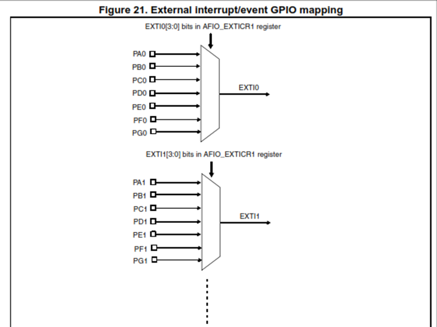

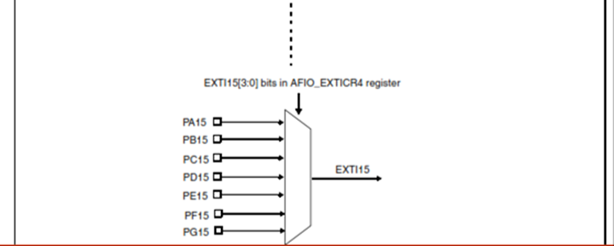

STM32F103C8T6 có 16 line ngắt ngoài (EXTI0 -> EXTI15).

Mỗi EXTI line chỉ có thể kết nối với một chân GPIO tại một thời điểm.

Chọn chân GPIO nào sẽ kết nối với line ngắt thông qua cấu hình AFIO.

Hàm `GPIO_EXTILineConfig(uint8_t GPIO_PortSource, uint8_t GPIO_PinSource)` cấu hình chân ở chế độ sử dụng ngắt ngoài:

- `GPIO_PortSource`: Chọn Port để sử dụng làm nguồn cho ngắt ngoài.

- `GPIO_PinSource`: Chọn Pin để cấu hình.

Các tham số ngắt ngoài được cấu hình trong `Struct EXTI_InitTypeDef`, gồm:

- `EXTI_Line`: Chọn line ngắt.

- `EXTI_Mode`: Chọn Mode cho ngắt là Ngắt (thực thi hàm ngắt) hay Sự kiện (Không thực thi).

- `EXTI_Trigger`: Cấu hình cạnh ngắt.

- `EXTI_LineCmd`: Cho phép ngắt ở Line đã cấu hình.
### Cấu hình NVIC
Trong trường hợp nhiều ngắt xảy ra thì cần cấu hình NVIC để xác định mức ưu tiên.

Hàm NVIC_PriorityGroupConfig(), phân chia số lượng bit dành cho Preemption Priority và Sub Priority
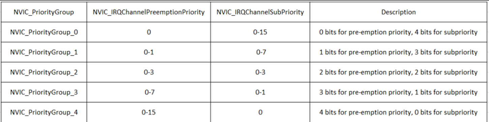
Bộ NVIC cấu hình các tham số ngắt và quản lý các vecto ngắt. Các tham số được cấu hình trong `NVIC_InitTypeDef`, bao gồm:

- `NVIC_IRQChannel`: Cấu hình Vector Line ngắt tương ứng với ngắt sử dụng:

  + Vector EXTI0 -> EXTI4: Quản lý Line0->Line4.

   + Vector EXTI9_5: Quản lý Line5->Line9.

   + Vector EXTI15_10: Quản lý Line10->Line15 
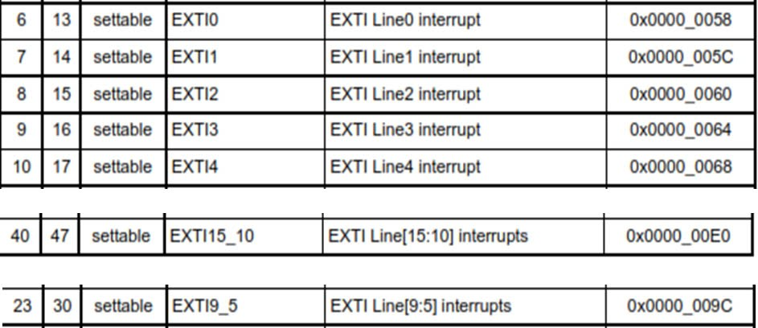

- `NVIC_IRQChannelPreemptionPriority`: Độ ưu tiên chính.

- `NVIC_IRQChannelSubPriority`: Độ ưu tiên phụ.

- `NVIC_IRQChannelCmd`: ENABLE/DISABLE ngắt

**Cấu hình mẫu cho chân PA0 làm ngắt ngoài**:
```c
// Hàm cấu hình EXTI line 0 cho PA0 với Pull-Up
void EXTI_Config(void) {
    // Bật Clock cho GPIOA và AFIO
    RCC_APB2PeriphClockCmd(RCC_APB2Periph_GPIOA | RCC_APB2Periph_AFIO, ENABLE);

    // Cấu hình PA0 làm Input Pull-Up
    GPIO_InitTypeDef GPIO_InitStruct;
    GPIO_InitStruct.GPIO_Pin = GPIO_Pin_0;
    GPIO_InitStruct.GPIO_Mode = GPIO_Mode_IPU; // Input Pull-Up
    GPIO_InitStruct.GPIO_Speed = GPIO_Speed_50MHz;
    GPIO_Init(GPIOA, &GPIO_InitStruct);

    // Cấu hình EXTI line 0 để kích hoạt ngắt ngoài từ PA0
    GPIO_EXTILineConfig(GPIO_PortSourceGPIOA, GPIO_PinSource0);

    EXTI_InitTypeDef EXTI_InitStruct;
    EXTI_InitStruct.EXTI_Line = EXTI_Line0;                 // Chọn line EXTI 0
    EXTI_InitStruct.EXTI_Mode = EXTI_Mode_Interrupt;        // Chế độ ngắt
    EXTI_InitStruct.EXTI_Trigger = EXTI_Trigger_Falling;    // Kích hoạt ngắt khi có cạnh xuống
    EXTI_InitStruct.EXTI_LineCmd = ENABLE;                  // Kích hoạt line EXTI 0
    EXTI_Init(&EXTI_InitStruct);

    // Cấu hình nhóm ưu tiên ngắt trong NVIC
    // 2 bit cho Preemption Priority, 2 bit cho Sub Priority
    NVIC_PriorityGroupConfig(NVIC_PriorityGroup_2);         

    // Cấu hình ưu tiên ngắt trong NVIC cho EXTI line 0
    NVIC_InitTypeDef NVIC_InitStruct;
    NVIC_InitStruct.NVIC_IRQChannel = EXTI0_IRQn;           // Kênh ngắt EXTI0
    NVIC_InitStruct.NVIC_IRQChannelPreemptionPriority = 0;  // Độ ưu tiên của ngắt (có thể tùy chỉnh)
    NVIC_InitStruct.NVIC_IRQChannelSubPriority = 0;         // Độ ưu tiên của ngắt (có thể tùy chỉnh)
    NVIC_InitStruct.NVIC_IRQChannelCmd = ENABLE;            // Kích hoạt kênh ngắt trong NVIC
    NVIC_Init(&NVIC_InitStruct);
}
```
### Hàm phục vụ ngắt
Ngắt trên từng line có hàm phục riêng của từng line. Có tên cố định: EXTIx_IRQHandler() (x là line ngắt tương ứng).

Hàm EXTI_GetITStatus(EXTI_Linex), Kiểm tra cờ ngắt của line x tương ứng.

Hàm EXTI_ClearITPendingBit(EXTI_Linex): Xóa cờ ngắt ở line x
Trong hàm phục vụ ngắt ngoài, chúng ta sẽ thực hiện:

- Kiểm tra ngắt đến từ line nào, có đúng là line cần thực thi hay không?

- Thực hiện các lệnh, các hàm.

- Xóa cờ ngắt ở line

**Hàm ngắt mẫu**:
```c
void EXTI0_IRQHandler()
    
{	// Kiểm tra ngắt line 0 
    if(EXTI_GetITStatus(EXTI_Line0) != RESET)
    {
        // Do somthing
    }
    // Xóa cờ ngắt line 0
    EXTI_ClearITPendingBit(EXTI_Line0);
}
```
## 2. Ngắt timer
### Cấu hình timer
Sử dụng ngắt timer, ta vẫn cấu hình các tham số trong TIM_TimeBaseInitTypeDef bình thường, riêng TIM_Period, đây là số lần đếm mà sau đó timer sẽ ngắt.

Cài đặt Period = 10-1 ứng với ngắt mỗi 1ms.

Hàm TIM_ITConfig(TIMx, TIM_IT_Update, ENABLE) kích hoạt ngắt cho TIMERx tương ứng
### Cấu hình NVIC
Ở NVIC, ta cấu hình tương tự như ngắt ngoài EXTI, tuy nhiên NVIC_IRQChannel được đổi thành TIM_IRQn để khớp với line ngắt timer.

**Cấu hình mẫu cho ngắt timer:**
```c
void TIM_Config(void) {
    // Cấu hình Timer 2
    TIM_TimeBaseInitTypeDef TIM_TimeBaseInitStruct;

    // Bật Clock cho Timer 2
    RCC_APB1PeriphClockCmd(RCC_APB1Periph_TIM2, ENABLE);

    // Cấu hình các tham số cho Timer 2
    TIM_TimeBaseInitStruct.TIM_Prescaler = 7200 - 1;         // Prescaler: 72 MHz / 7200 = 10 kHz
    TIM_TimeBaseInitStruct.TIM_Period = 10000 - 1;           // Period: 1s đếm lên 1 lần 
    TIM_TimeBaseInitStruct.TIM_ClockDivision = TIM_CKD_DIV1; // Không chia thêm xung clock
    TIM_TimeBaseInitStruct.TIM_CounterMode = TIM_CounterMode_Up; // Đếm tăng
    TIM_TimeBaseInit(TIM2, &TIM_TimeBaseInitStruct);

    // Bật ngắt Timer 2 cho sự kiện cập nhật
    TIM_ITConfig(TIM2, TIM_IT_Update, ENABLE);

    // Kích hoạt Timer 2
    TIM_Cmd(TIM2, ENABLE);

    // Cấu hình NVIC cho Timer 2
    NVIC_Config();
}

void NVIC_Config(void) {
    // Thiết lập cấu hình nhóm ưu tiên ngắt
    NVIC_PriorityGroupConfig(NVIC_PriorityGroup_2); // 2 bit cho Preemption Priority, 2 bit cho Sub Priority

    // Cấu hình ngắt cho Timer 2 trong NVIC
    NVIC_InitTypeDef NVIC_InitStruct;
    NVIC_InitStruct.NVIC_IRQChannel = TIM2_IRQn;             // Chọn kênh ngắt của Timer 2
    NVIC_InitStruct.NVIC_IRQChannelPreemptionPriority = 0;   // Thiết lập độ ưu tiên preemption
    NVIC_InitStruct.NVIC_IRQChannelSubPriority = 0;          // Thiết lập độ ưu tiên sub
    NVIC_InitStruct.NVIC_IRQChannelCmd = ENABLE;             // Kích hoạt kênh ngắt trong NVIC
    NVIC_Init(&NVIC_InitStruct);
}
```
### Hàm phục vụ ngắt timer
Hàm phục vụ ngắt Timer được đặt tên : `TIMx_IRQHandler()` với x là timer tương ứng.

Kiểm tra cờ bằng hàm `TIM_GetITStatus()` Hàm này trả về giá trị kiểm tra xem timer đã tràn hay chưa.

`TIM_IT_Update:` Cờ báo tràn và update giá trị cho timer, cờ này bật lên mỗi 1ms.

Sau khi thực hiện xong, gọi `TIM_ClearITPendingBit(TIMx, TIM_IT_Update)` để xóa cờ này

**Tạo Delay dựa trên hàm phục vụ ngắt timer:**
```c
uint16_t count;

void delay(int time)
{
    count = 0; 
    while(count<time){}
}

void TIM2_IRQHandler()
{
    // Chờ ngắt
    if(TIM_GetITStatus(TIM2, TIM_IT_Update))
    {
    count++;
    }
    // Xóa cờ ngắt
    TIM_ClearITPendingBit(TIM2, TIM_IT_Update);
}
```
## 3. Ngắt truyền thông
STM32F1 hỗ trợ các ngắt cho các giao thức truyền nhận như SPI, I2C, UART…

Ví dụ với UART ngắt.

Các ngắt ở SPI, I2C… sẽ được cấu hình tương tự như UART
### Cấu hình UART:
Đầu tiên, các cấu hình tham số cho UART thực hiện bình thường.

Trước khi cho phép UART hoạt động, cần kích hoạt ngắt UART bằng cách gọi hàm `USART_ITConfig();`

Hàm `USART_ClearFlag(USART1, USART_IT_RXNE);` được gọi để xóa cờ ngắt ban đầu.

Gồm 3 tham số:

`USART_TypeDef* USARTx:` Bộ UART cần cấu hình.

`uint16_t USART_IT:` Chọn nguồn ngắt UART, có nhiều nguồn ngắt từ UART, ở bài này ta chú ý đến ngắt truyền `(USART_IT_TXE)` và ngắt nhận `(USART_IT_RXNE)`.

FunctionalState NewState: Cho phép ngắt.
### Cấu hình NVIC
Ở NVIC, ta cấu hình tương tự như ngắt ngoài EXTI, ngắt Timer, tuy nhiên NVIC_IRQChannel được đổi thành UARTx_IRQn

**Cấu hình mẫu cho ngắt nhận UART:**
```c
void UART_Config(void) 
{
    // Bật Clock cho USART1
    RCC_APB2PeriphClockCmd(RCC_APB2Periph_USART1, ENABLE);

    // Bật Clock cho GPIOA (dùng cho các chân TX và RX)
    RCC_APB2PeriphClockCmd(RCC_APB2Periph_GPIOA, ENABLE);

    // Cấu hình PA9 (TX) làm chân xuất với chế độ chức năng thay thế push-pull
    GPIO_InitTypeDef GPIO_InitStruct;
    GPIO_InitStruct.GPIO_Pin = GPIO_Pin_9;
    GPIO_InitStruct.GPIO_Mode = GPIO_Mode_AF_PP;
    GPIO_InitStruct.GPIO_Speed = GPIO_Speed_50MHz;
    GPIO_Init(GPIOA, &GPIO_InitStruct);

    // Cấu hình PA10 (RX) làm chân nhập với chế độ input floating
    GPIO_InitStruct.GPIO_Pin = GPIO_Pin_10;
    GPIO_InitStruct.GPIO_Mode = GPIO_Mode_IN_FLOATING;
    GPIO_Init(GPIOA, &GPIO_InitStruct);

    // Cấu hình các thông số cho UART
    USART_InitTypeDef UART_InitStruct;
    UART_InitStruct.USART_Mode = USART_Mode_Rx | USART_Mode_Tx;           // Chế độ RX và TX
    UART_InitStruct.USART_BaudRate = 9600;                                // Tốc độ Baud 9600
    UART_InitStruct.USART_HardwareFlowControl = USART_HardwareFlowControl_None; // Không dùng kiểm soát luồng phần cứng
    UART_InitStruct.USART_WordLength = USART_WordLength_8b;               // Độ dài dữ liệu 8 bit
    UART_InitStruct.USART_StopBits = USART_StopBits_1;                    // 1 bit dừng
    UART_InitStruct.USART_Parity = USART_Parity_No;                       // Không dùng bit chẵn lẻ
    USART_Init(USART1, &UART_InitStruct);

    // Kích hoạt ngắt RX
    USART_ITConfig(USART1, USART_IT_RXNE, ENABLE);

    // Kích hoạt USART1
    USART_Cmd(USART1, ENABLE);
}

void NVIC_Config(void) 
{
    // Thiết lập cấu hình nhóm ưu tiên ngắt
    NVIC_PriorityGroupConfig(NVIC_PriorityGroup_2); // 2 bit cho Preemption Priority, 2 bit cho Sub Priority

    // Cấu hình ngắt cho USART1 trong NVIC
    NVIC_InitTypeDef NVIC_InitStruct;
    NVIC_InitStruct.NVIC_IRQChannel = USART1_IRQn;            // Chọn kênh ngắt của UART1
    NVIC_InitStruct.NVIC_IRQChannelPreemptionPriority = 0;    // Thiết lập độ ưu tiên preemption
    NVIC_InitStruct.NVIC_IRQChannelSubPriority = 0;           // Thiết lập độ ưu tiên sub
    NVIC_InitStruct.NVIC_IRQChannelCmd = ENABLE;              // Kích hoạt kênh ngắt trong NVIC
    NVIC_Init(&NVIC_InitStruct);
}
```
### Hàm phục vụ ngắt UART:
Hàm `USARTx_IRQHandler()` sẽ được gọi nếu xảy ra ngắt trên Line ngắt UART đã cấu hình.

Hàm `USART_GetITStatus` kiểm tra các cờ ngắt UART. Hàm này nhận 2 tham số là bộ USART và cờ tương ứng cần kiểm tra:

- `USART_IT_RXNE:` Cờ ngắt nhận, cờ này set lên 1 khi bộ USART phát hiện data truyền tới.

- `USART_IT_TXE:` Cờ ngắt truyền, cờ này set lên 1 khi USART truyền data xong.

Có thể xóa cờ ngắt, gọi hàm USART_ClearITPendingBit để đảm bảo không còn ngắt trên line (thông thường cờ ngắt sẽ tự động xóa).

Trong hàm ngắt, ta thực hiện:

- Kiểm tra ngắt

- Nhận và lưu data từ USART1.

- Kiểm tra cờ ngắt truyền, đảm bảo USART đang rỗi.

- Truyền lại data vừa nhận được.

- Xóa cờ ngắt, thoát khỏi hàm.

**Hàm phục vụ ngắt UART nhận data mẫu:**
```c
uint8_t data = 0x00;
void USART1_IRQHandler()
{
    // Kiểm tra nếu có ngắt RXNE (dữ liệu đã được nhận)
    if(USART_GetITStatus(USART1, USART_IT_RXNE) != RESET) {
        // Đọc dữ liệu từ bộ đệm nhận
        data = USART_ReceiveData(USART1);

        // Chờ cho đến khi bộ đệm truyền sẵn sàng (TXE)
        while(USART_GetFlagStatus(USART1, USART_FLAG_TXE) == RESET);

        // Gửi lại dữ liệu vừa nhận được
        USART_SendData(USART1, data);

        // Xóa cờ ngắt RXNE
        USART_ClearITPendingBit(USART1, USART_IT_RXNE);
    }
}
```

</p>
</details>

# LESSON 09: ADC - ANALOG TO DIGITAL CONVERTER

<details><summary>Chi tiết</summary>
<p>

## 1. Lý thuyết ADC
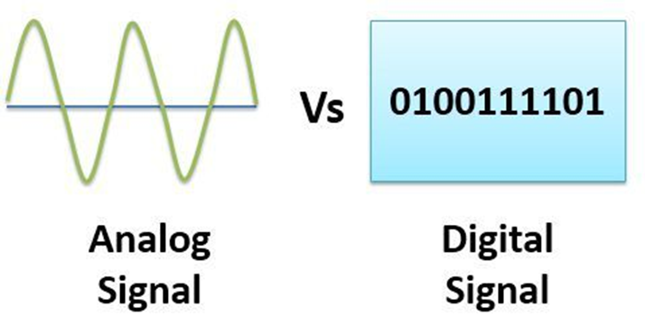

ADC là mạch điện tử lấy điện áp tương tự làm đầu vào và chuyển đổi nó thành dữ liệu số (1 giá trị đại diện cho mức điện áp trong mã nhị phân).

Khả năng chuyển đổi của ADC được quyết định bởi 2 yếu tố chính:

- Độ phân giải: Số bit mà ADC sử dụng để mã hóa tín hiệu. Có thể xem như là số mức mà tín hiệu tương tự được biểu diễn. ADC có độ phân giải càng cao thì cho ra kết quả chuyển đổi càng chi tiết

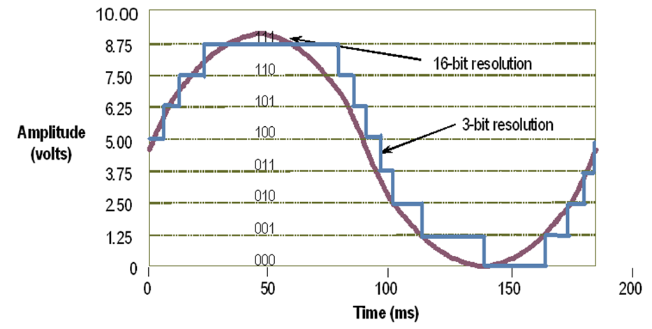

- Tần số/chu kì lấy mẫu: Tốc độ/khoảng thời gian giữa 2 lần mã hóa. Tần số lấy mẫu càng lớn thì tín hiệu sau khi chuyển đổi sẽ có độ chính xác càng cao. Khả năng tái tạo lại tín hiệu càng chính xác. Tần số lấy mẫu = 1/(Time lấy mẫu + Time chuyển đổi.)
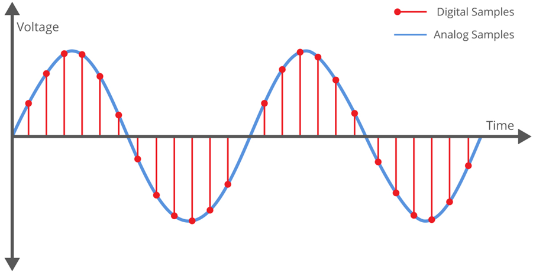
Tần số lấy mẫu phải lớn hơn tần số của tín hiệu ít nhất 2 lần để đảm bảo độ chính xác khi khôi phục lại tín hiệu

## 2. Lập trình ADC
STM32F103C8 có 2 bộ ADC đó là ADC1 và ADC2 với nhiều mode hoạt động Kết quả chuyển đổi được lưu trữ trong thanh ghi 16 bit.

Độ phân giải 12 bit. Có các ngắt hỗ trợ. Có thể điều khiển hoạt động ADC bằng xung Trigger. Thời gian chuyển đổi nhanh : 1us tại tần số 65Mhz. Có bộ DMA giúp tăng tốc độ xử lí
### Cấp xung RCC
Các bộ ADC được cấp xung từ RCC APB2, để bộ ADC hoạt động cần cấp xung cho cả ADC để tạo tần số lấy mẫu tín hiệu và cấp xung cho GPIO của Port ngõ vào
```c
void RCC_Config()
{
	RCC_APB2PeriphClockCmd(RCC_APB2Periph_GPIOA | RCC_APB2Periph_ADC1 | RCC_APB2Periph_AFIO, ENABLE);
	RCC_APB1PeriphClockCmd(RCC_APB1Periph_TIM2, ENABLE);
}
```
### Cấu hình chân đọc tín hiệu và tham số cho ADC
#### Regular Conversion:

- Single: ADC chỉ đọc 1 kênh duy nhất, và chỉ đọc khi nào được yêu cầu.

- Single Continuous: ADC sẽ đọc một kênh duy nhất, nhưng đọc dữ liệu nhiều lần liên tiếp (Có thể được biết đến như sử dụng DMA để đọc dữ liệu và ghi vào bộ nhớ).

- Scan: Multi-Channels: Quét qua và đọc dữ liệu nhiều kênh, nhưng chỉ đọc khi nào được yêu cầu.

- Scan: Continuous Multi-Channels Repeat: Quét qua và đọc dữ liệu nhiều kênh, nhưng đọc liên tiếp nhiều lần giống như Single Continous
#### Injected Conversion:

Trong trường hợp nhiều kênh hoạt động. Khi kênh có mức độ ưu tiên cao hơn có thể tạo ra một Injected Trigger. Khi gặp Injected Trigger thì ngay lập tức kênh đang hoạt động bị ngưng lại để kênh được ưu tiên kia có thể hoạt động.

Cấu hình GPIO: ADC hỗ trợ rất nhiều kênh, mỗi kênh lấy tín hiệu từ các chân GPIO của các Port và từ các chân khác. Các chân GPIO dùng làm ngõ vào cho ADC sẽ được cấu hình Mode AIN.(Analogue Input).

Các tham số cấu hình cho bộ ADC được tổ chức trong `Struct ADC_InitTypeDef:`

- `ADC_Mode:` Cấu hình chế độ hoạt động cho ADC là đơn kênh (Independent) hay đa kênh, ngoài ra còn có các chế độ ADC chuyển đổi tuần tự các kênh (regularly) hay chuyển đổi khi có kích hoạt (injected).

- `ADC_NbrOfChannel:` Số kênh ADC để cấu hình.

- `ADC_ContinuousConvMode:` Cấu hình bộ ADC có chuyển đổi liên tục hay không, Enable để cấu hình ADC chuyển đổi lien tục, nếu cấu hình Disable, ta phải gọi lại lệnh đọc ADC để bắt đầu quá trình chuyển đổi.

- `ADC_ExternalTrigConv:` Enable để sử dụng tín hiệu trigger.

- `ADC_ScanConvMode:` Cấu hình chế độ quét ADC lần lượt từng kênh. Enable nếu sử dụng chế độ quét này.

- `ADC_DataAlign:` Cấu hình căn lề cho data. Vì bộ ADC xuất ra giá trị 12bit, được lưu vào biến 16 hoặc 32 bit nên phải căn lề các bit về trái hoặc phải.

Ngoài các tham số trên, cần cấu hình thêm thời gian lấy mẫu, thứ tự kênh ADC khi quét,

- `ADC_RegularChannelConfig(ADC_TypeDef* ADCx, uint8_t ADC_Channel, uint8_t Rank, uint8_t ADC_SampleTime):`

  - `Rank:` Ưu tiên của kênh ADC.

   - `SampleTime:` Thời gian lấy mẫu tín hiệu.

- `ADC_SoftwareStartConvCmd(ADC_TypeDef* ADCx, FunctionalState NewState):` Bắt đầu quá trình chuyển đổi.

- `ADC_GetConversionValue(ADC_TypeDef* ADCx):` Đọc giá trị chuyển đổi được ở các kênh ADC tuần tự.

- `ADC_GetDualModeConversionValue(void):` Trả về giá trị chuyển đổi cuối cùng của ADC1, ADC2 ở chế độ kép.

```c
void GPIO_Config()
{
    GPIO_InitTypeDef GPIO_InitStruct;
    GPIO_InitStruct.GPIO_Mode = GPIO_Mode_AIN;
    GPIO_InitStruct.GPIO_Pin = GPIO_Pin_0;
    GPIO_InitStruct.GPIO_Speed = GPIO_Speed_50MHz;
    GPIO_Init(GPIOA, &GPIO_InitStruct);
}

void ADC_Config()
{
    ADC_InitTypeDef ADC_InitStruct;

    ADC_InitStruct.ADC_Mode = ADC_Mode_Independent;
    ADC_InitStruct.ADC_NbrOfChannel = 1;
    ADC_InitStruct.ADC_ScanConvMode = DISABLE;
    ADC_InitStruct.ADC_ExternalTrigConv = ADC_ExternalTrigConv_None;
    ADC_InitStruct.ADC_ContinuousConvMode = ENABLE;
    ADC_InitStruct.ADC_DataAlign = ADC_DataAlign_Right;

    ADC_Init(ADC1, &ADC_InitStruct);
    ADC_RegularChannelConfig(ADC1, ADC_Channel_0, 1, ADC_SampleTime_55Cycles5);
    ADC_Cmd(ADC1, ENABLE);
    ADC_SoftwareStartConvCmd(ADC1, ENABLE);
}
```
### Đọc tín hiệu
#### Lọc tín hiệu bằng Kalman
Giá trị đo được trên ADC có thể bị nhiễu, vọt lố do nhiều lý do khách quan về phần cứng.

Phương pháp trung bình không thể giảm thiểu nhiễu, thay vào đó sử dụng lọc Kalman
```c
// Global variables for Kalman Filter
float _err_measure = 1;  // Measurement error (initial value)
float _err_estimate = 1; // Estimation error (initial value)
float _q = 0.01;         // Process noise
float _kalman_gain = 0;
float _current_estimate = 0; // Current estimated value
float _last_estimate = 0;    // Previous estimated value

// Kalman Filter initialization function
void SimpleKalmanFilter(float mea_e, float est_e, float q)
{
    _err_measure = mea_e;
    _err_estimate = est_e;
    _q = q;
}

// Kalman Filter update function
float updateEstimate(float mea)
{
    _kalman_gain = _err_estimate / (_err_estimate + _err_measure);
    _current_estimate = _last_estimate + _kalman_gain * (mea - _last_estimate);
    _err_estimate = (1.0 - _kalman_gain) * _err_estimate + fabs(_last_estimate - _current_estimate) * _q;
    _last_estimate = _current_estimate;
    return _current_estimate;
}
```
</p>
</details>

# LESSON 10: DMA - DIRECT MEMORY ACCESS
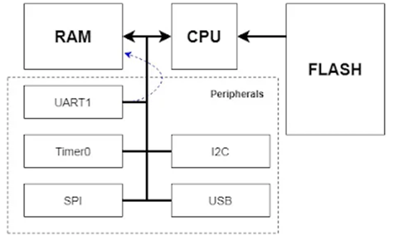

CPU sẽ điều khiển việc trao đổi data giữa ngoại vi (UART, I2C, SPI, ...) và bộ nhớ (RAM) qua các đường bus.

CPU phải lấy lệnh từ bộ nhớ (FLASH) để thực thi các lệnh của chương trình.

Vì vậy, khi cần truyền dữ liệu liên tục giữa Peripheral và RAM, CPU sẽ bị chiếm dụng, và không có thời gian làm các công việc khác, hoặc có thể gây miss dữ liệu khi transfer

## 1. Lý thuyết DMA - Truy cập bộ nhớ trực tiếp
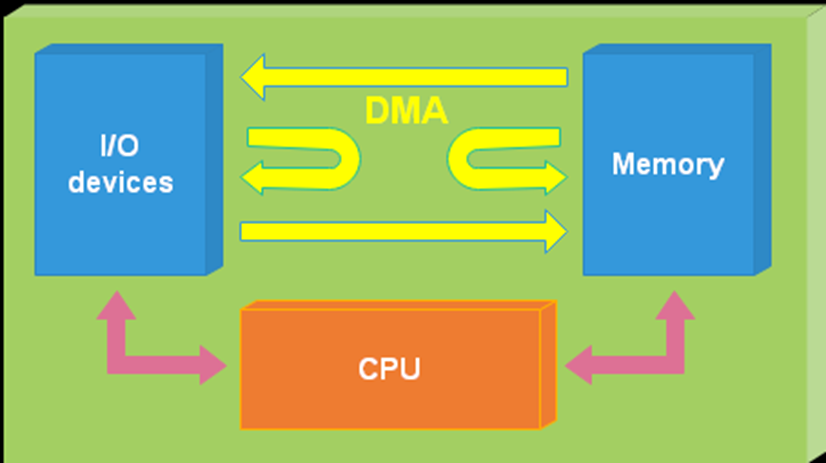

DMA có thể truyền data trực tiếp với tốc độ cao từ :

- Bộ nhớ đến ngoại vi và ngược lại.

- Giữa 2 vùng nhớ.

Giúp CPU không phải xử lý data, tiết kiệm tài nguyên CPU cho thao tác khác. Đồng thời giảm thiểu việc data nhận về từ ngoại vi bị m
