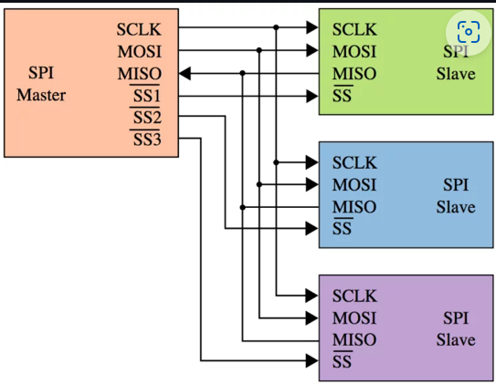
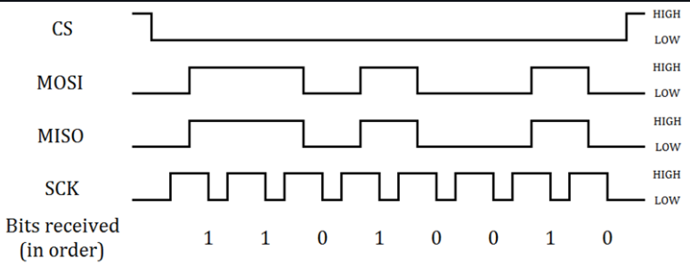
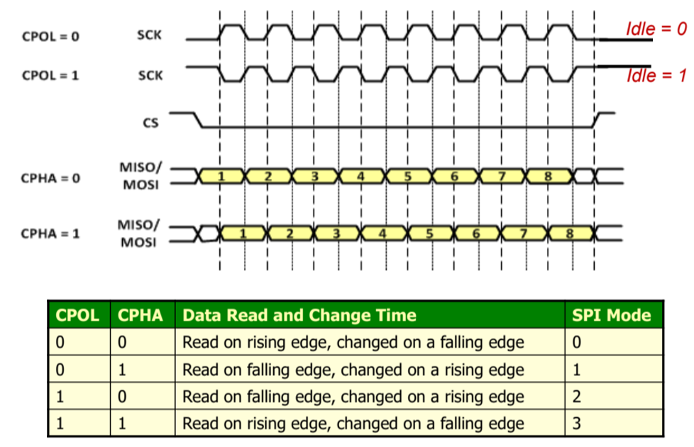
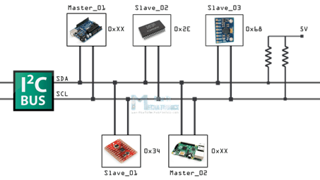
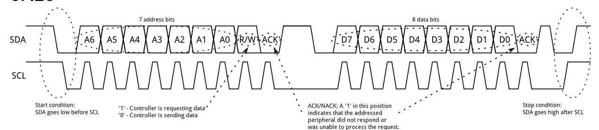
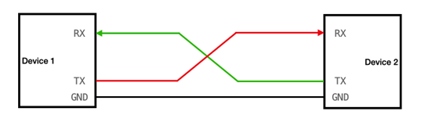
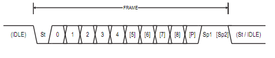
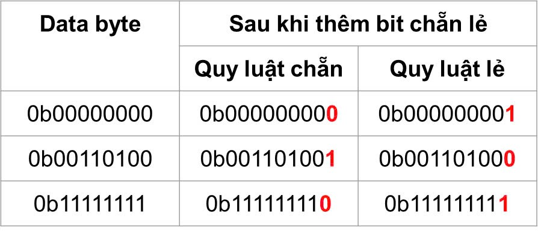

# LESSON 01: SET UP AND CREATE NEW PROJECTS IN KEILC
<details><summary>Chi tiết</summary>
<p>

</p>
</details>


# LESSON 2: GPIO

<details><summary>Chi tiết</summary>
<p>

## 1. Thư viện STM32F10x SPL (Standard Peripherals Library)
## 2.  Lý thuyết về GPIO
GPIO-General Purpose Input/Output là các chân trên vi điều khiển có thể lập trình để truyền nhận tín hiệu với các thiết bị bên ngoài hoặc thực hiện các chức năng giao tiếp khác.   
### Lập trình với GPIO:
Cấu hình, điều khiển các ngoại vi sử dụng thư viện SPL (Standard Peripheral Firmware Library). Thư viện SPL cung cấp các hàm và các định nghĩa giúp việc cấu hình và sử dụng ngoại vi dễ dàng và rõ ràng. Ở trong thư viện này, các cấu hình được chia thành các trường và định nghĩa bằng các cấu trúc như struct và enum
#### Cấp xung clock cho GPIO
Trong SPL, để bật xung clock cho ngoại vi GPIO
```c
void RCC_Config(){
	RCC_APB2PeriphClockCmd(RCC_APB2Periph_GPIOC, ENABLE);
} 
```
- Tham số thứ 1 là ngoại vi cần cấu hình clock
- Tham số thứ 2 là giá trị quy định cấp (ENABLE) hay ngưng (DISABLE) xung clock cho ngoại vi đó

#### Cấu hình GPIO:
```c
void GPIO_Config(){
	GPIO_InitTypeDef GPIO_InitStructure;
	GPIO_InitStructure.GPIO_Pin = GPIO_Pin_13 | GPIO_Pin_14;
	GPIO_InitStructure.GPIO_Mode = GPIO_Mode_Out_PP;
	GPIO_InitStructure.GPIO_Speed = GPIO_Speed_50MHz;
	
	GPIO_Init(GPIOC, &GPIO_InitStructure);
}
```
Việc cấu hình GPIO được thực hiện thông qua việc khai báo và sử dụng struct `GPIO_InitTypeDef`, trong đó chứa các tham số cấu hình cho một chân GPIO cụ thể:
- **GPIO_Pin**: Xác định chân hoặc các chân GPIO muốn cấu hình bằng cách sử dụng các macro như `GPIO_Pin_0`, `GPIO_Pin_1`,... hoặc kết hợp các chân bằng toán tử OR `|` nếu muốn cấu hình nhiều chân cùng lúc
```c
#define GPIO_Pin_0                ((uint16_t)0x0001)  /*!< Pin 0 selected */
#define GPIO_Pin_1                ((uint16_t)0x0002)  /*!< Pin 1 selected */
#define GPIO_Pin_2                ((uint16_t)0x0004)  /*!< Pin 2 selected */
#define GPIO_Pin_3                ((uint16_t)0x0008)  /*!< Pin 3 selected */
#define GPIO_Pin_4                ((uint16_t)0x0010)  /*!< Pin 4 selected */
#define GPIO_Pin_5                ((uint16_t)0x0020)  /*!< Pin 5 selected */
#define GPIO_Pin_6                ((uint16_t)0x0040)  /*!< Pin 6 selected */
#define GPIO_Pin_7                ((uint16_t)0x0080)  /*!< Pin 7 selected */
#define GPIO_Pin_8                ((uint16_t)0x0100)  /*!< Pin 8 selected */
#define GPIO_Pin_9                ((uint16_t)0x0200)  /*!< Pin 9 selected */
#define GPIO_Pin_10               ((uint16_t)0x0400)  /*!< Pin 10 selected */
#define GPIO_Pin_11               ((uint16_t)0x0800)  /*!< Pin 11 selected */
#define GPIO_Pin_12               ((uint16_t)0x1000)  /*!< Pin 12 selected */
#define GPIO_Pin_13               ((uint16_t)0x2000)  /*!< Pin 13 selected */
#define GPIO_Pin_14               ((uint16_t)0x4000)  /*!< Pin 14 selected */
#define GPIO_Pin_15               ((uint16_t)0x8000)  /*!< Pin 15 selected */
#define GPIO_Pin_All              ((uint16_t)0xFFFF)  /*!< All pins selected */
```
- **GPIO_Mode**: Xác định mode hoạt động của chân GPIO
```c
typedef enum
{
    GPIO_Mode_AIN        = 0x0,
    GPIO_Mode_IN_FLOATING = 0x04,
    GPIO_Mode_IPD        = 0x28,
    GPIO_Mode_IPU        = 0x48,
    GPIO_Mode_Out_OD     = 0x14,
    GPIO_Mode_Out_PP     = 0x10,
    GPIO_Mode_AF_OD      = 0x1C,
    GPIO_Mode_AF_PP      = 0x18
} GPIOMode_TypeDef;
```
- **GPIO_Speed**: Chọn tốc độ đáp ứng của chân GPIO
```c
typedef enum
{
    GPIO_Speed_10MHz = 1,
    GPIO_Speed_2MHz,
    GPIO_Speed_50MHz
} GPIOSpeed_TypeDef;
```
Hàm khởi tạo GPIO_Init() nhận 2 tham số:
- **GPIO_TypeDef**: Chỉ định cổng GPIO muốn cấu hình (ví dụ: `GPIOA`, `GPIOB`, `GPIOC`,...).
- **&GPIO_InitStruct**: Con trỏ đến biến cấu trúc `GPIO_InitTypeDef` chứa các thông số cấu hình
#### Sử dụng GPIO
**Một số hàm thao tác với GPIO:**

- Đọc giá trị mức logic (0 hoặc 1) của một chân Input/Output cụ thể trên cổng GPIO
```c
uint8_t GPIO_ReadInputDataBit(GPIO_TypeDef* GPIOx, uint16_t GPIO_Pin);
uint8_t GPIO_ReadOutputDataBit(GPIO_TypeDef* GPIOx, uint16_t GPIO_Pin);
```
- Đọc toàn bộ giá trị đầu vào/ra của một cổng GPIO

*Giá trị trả về 16-bit, mỗi bit tương ứng với trạng thái của từng chân của cổng*
```c
uint16_t GPIO_ReadInputData(GPIO_TypeDef* GPIOx);
uint16_t GPIO_ReadOutputData(GPIO_TypeDef* GPIOx);
```
- Cho giá trị điện áp Đặt mức cao (1) / thấp (0) cho một hoặc nhiều chân output sử dụng OR `|` trên một cổng GPIO
```c
void GPIO_SetBits(GPIO_TypeDef* GPIOx, uint16_t GPIO_Pin);
void GPIO_ResetBits(GPIO_TypeDef* GPIOx, uint16_t GPIO_Pin);
```
- Ghi mức logic cụ thể (0 hoặc 1) cho một chân output
```c
void GPIO_WriteBit(GPIO_TypeDef* GPIOx, uint16_t GPIO_Pin, BitAction BitVal);
```
- Ghi một giá trị 16-bit trực tiếp cho toàn bộ cổng GPIO, trong đó mỗi bit đại diện cho trạng thái của một chân
```c
void GPIO_Write(GPIO_TypeDef* GPIOx, uint16_t PortVal);
```
</p>
</details>

# LESSON 3: INTERRUPTS AND TIMER

<details><summary>Chi tiết</summary>
<p>

## 1. Ngắt

Ngắt là một cơ chế cho phép hệ thống tạm ngừng chương trình đang thực hiện để xử lý một sự kiện ưu tiên cao hơn, sau đó quay lại hoàn thành công việc còn dở.

Khi một ngắt xảy ra, vi điều khiển sẽ lưu lại trạng thái hiện tại và chuyển tới hàm phục vụ ngắt (ISR - Interrupt Service Routine).

Có 3 loại ngắt chính: Ngắt ngoài, ngắt timer, ngắt truyền thông

### Vector table
Vector table là một vùng trong bộ nhớ của vi điều khiển, chứa các địa chỉ của các hàm phục vụ ngắt tương ứng với từng ngắt

### Độ ưu tiên ngắt
Mỗi ngăt có độ ưu tiên khác nhau. Khi nhiều ngắt xảy ra, độ ưu tiên sẽ quyết định ngắt nào sẽ được thực thi trước.

STM32 quy định ngắt nào có số ưu tiên càng thấp thì có quyền càng cao. Các ưu tiên ngắt có thể lập trình được.

### Ngắt ngoài
Xảy ra khi có thay đổi điện áp trên các chân GPIO được cấu hình làm ngõ vào ngắt.

- LOW: kích hoạt ngắt liên tục khi chân ở mức thấp.

- HIGH: Kích hoạt liên tục khi chân ở mức cao.

- Rising: Kích hoạt khi trạng thái trên chân chuyển từ thấp lên cao.

- Falling: Kích hoạt khi trạng thái trên chân chuyển từ cao xuống thấp.
### Ngắt timer
Ngắt Timer xảy ra khi giá trị trong thanh ghi đếm của timer tràn. Giá trị tràn được xác định bởi giá trị cụ thể trong thanh ghi đếm của timer.

Vì đây là ngắt nội trong MCU, nên phải reset giá trị thanh ghi timer để có thể tạo được ngắt tiếp theo

### Ngắt truyền thông
Ngắt truyền thông xảy ra khi có sự kiện truyền/nhận dữ liệu giữa MCU với các thiết bị bên ngoài hay với MCU.

Ngắt này sử dụng cho nhiều phương thức như Uart, SPI, I2C…v.v nhằm đảm bảo việc truyền nhận chính xác

## Timer
Có thể hiểu 1 cách đơn giản: timer là 1 mạch digital logic có vai trò đếm mỗi chu kỳ clock (đếm lên hoặc đếm xuống).

Timer còn có thể hoạt động ở chế độ nhận xung clock từ các tín hiệu ngoài. Có thể là từ 1 nút nhấn, bộ đếm sẽ được tăng sau mỗi lần bấm nút (sườn lên hoặc sườn xuống tùy vào cấu hình). Ngoài ra còn các chế độ khác như PWM, định thời …vv.

STM32F103 có 7 Timer

### Cấu hình timer
- `TIM_ClockDivision`: Hệ số chia xung nhịp cho bộ lọc trong các chế độ Input Capture/Output Compare. Tham số này không ảnh hưởng đến tần số đếm của Timer.

- `TIM_Prescaler`: Dùng để chia tần số xung nhịp đầu vào cho Timer (tần số từ bus APB) trước khi cấp cho bộ đếm, điều chỉnh tốc độ đếm của Timer.

- `TIM_Period`: Giá trị tối đa mà bộ đếm sẽ đạt tới trước khi tràn và quay về đếm lại từ 0.

- `TIM_CounterMode`: Chế độ đếm.

- `TIM_CounterMode_Up`, `TIM_CounterMode_Down`: Đếm lên/xuống.

- `TIM_CounterMode_CenterAligned1,...`: Đếm ở giữa dùng cho PWM

Cấu hình mẫu cho timer và delay ms:
```c 
TIM_Config
{
    // Clock - Nguồn APB2: 72MHz
    RCC_APB1PeriphClockCmd(RCC_APB1Periph_TIM2, ENABLE);

    // Config parameters
    TIM_TimeBaseInitTypeDef TIM_TimeBaseInitStruct;

    TIM_TimeBaseInitStruct.TIM_ClockDivision = TIM_CKD_DIV1;     // Clock division (chỉ áp dụng cho bộ lọc Input Capture/Output Compare)
    TIM_TimeBaseInitStruct.TIM_Prescaler = 7200 - 1;             // Prescaler: 72 MHz / 7200 = 10 kHz (tần số thực tế của Timer, tần số đếm)
    TIM_TimeBaseInitStruct.TIM_Period = 0xFFFF;                  // Period: Đếm từ 0 đến 0xFFFF (65535), sau đó sẽ tràn

    // Chu kì timer/chu kì 1 lần đếm cho period từ 0->1: 1/10kHz = 0.1 ms

    TIM_TimeBaseInitStruct.TIM_CounterMode = TIM_CounterMode_Up; 

    // Enable TIM2
    TIM_TimeBaseInit(TIM2, &TIM_TimeBaseInitStruct);
    TIM_Cmd(TIM2, ENABLE);
}

void Delay_ms(uint16_t time_ms) 
{
    // Reset the Timer 2 counter
    TIM_SetCounter(TIM2, 0);

    // Calculate the required ticks
    uint16_t ticks = time_ms * 10; // With Timer frequency at 10 kHz, each tick equals 1 ms

    // Wait until the counter reaches the required ticks
    while (TIM_GetCounter(TIM2) < ticks);
}
```
</p>
</details>

# LESSON 04: BASIC COMMUNICATION PROTOCOLS
<details><summary>Chi tiết</summary>
<p>

## 1. SPI - Serial Peripheral Interface
### Đặc điểm và cấu trúc vật lý



SPI là chuẩn giao tiếp nối tiếp, đồng bộ, cấu trúc Master - Slave, song công

Bốn chân giao tiếp gồm:

- SCK (Serial Clock): Master tạo xung tín hiệu SCK và cung cấp cho Slave.
- MISO (Master Input Slave Output): Master nhận tín hiệu từ Slave.
- MOSI (Master Output Slave Input): Slave nhận tín hiệu từ Master.
- CS (Chip Select): Chọn Slave cụ thể để giao tiếp bằng cách xuất tín hiệu đường SS tương ứng xuống mức 0 (Low).

### SPI frame và quá trình truyền nhận



Một frame thông điệp trong SPI thường là 8 bit, gửi MSB trước hoặc LSB trước tùy hệ thống.

- Bắt đầu, master sẽ kéo chân CS của slave muốn giao tiếp xuống 0.

- Clock sẽ được cấp bởi master, tùy vào chế độ hoạt động, với mỗi xungc clock, 1 bit sẽ được truyền từ master đến slave và slave cũng truyền 1 bit cho master.

- Lặp lại quá trình trên đến khi truyền xong 8 bit.

- Kết thúc, master kéo chân CS lên 1
### Chế độ hoạt động
SPI có 4 chế độ hoạt động phụ thuộc vào CPOL - Clock Polarity và CPHA - Clock Phase.

Ý nghĩa của CPOL và CPHA:

- CPOL = 0: Xung clock ở mức thấp (0) khi bus ở trạng thái nghỉ.
- CPOL = 1: Xung clock ở mức cao (1) khi bus ở trạng thái nghỉ.
- CPHA = 0: Bit data được gửi tại cạnh đầu tiên của xung clock.
- CPHA = 1: Bit data được gửi tại cạnh thứ hai của xung clock.



## 2. I2C - Inter-Integrated Circuit
### Đặc điểm và cấu trúc vật lý
I2C là chuẩn giao tiếp nối tiếp, đồng bộ, cấu trúc Master - Slave, bán song công.

Hai dây giao tiếp gồm:

- SDA (Serial Data Line): Dây truyền dữ liệu.
- SCL (Serial Clock Line) Dây xung clock



*Điện trở kéo lên: Thường 4.7 kΩ, VCC: Thường là 3.3V hoặc 5V để chống nhiễu*

### I2C frame và quá trình truyền nhận



Một frame thông điệp của I2C gồm:

- Start: SDA từ 1 xuống 0 trước SCL.

- 7->10 bit địa chỉ + 1 bit 0 hoặc 1 tương ứng với ghi/đọc, gửi MSB trước.

- ACK: Nếu Slave nhận được đúng địa chỉ nó sẽ gửi một bit ACK = 0.

- 8 bit data: Có thể là data do Master gửi (write) hoặc đọc về từ Slave (read), gửi MSB trước.

- Stop: SDA từ 0 lên 1 sau SCL

## 3. UART - Universal Asynchronous Receiver-Transmitter
### Đặc điểm và cấu trúc vật lý



UART là chuẩn giao tiếp nối tiếp, không đồng bộ, song công.

Hai dây giao tiếp gồm:

- TX (Transmit): Truyền dữ liệu ra.

- RX (Receive): Nhận dữ liệu vào.

Cả hai thiết bị trong giao tiếp UART dùng baud rate khớp nhau để truyền nhận dữ liệu chính xác.

Baud rate là tốc độ truyền dữ liệu được tính bằng số bit trên giây.

Các mức baud rate có sẵn: 9600, 19200, 38400, 57600, ...

Ví dụ: baudrate = 9600 => 1 bit = 0.10467 ms

### UART frame và quá trình truyền nhận



Một frame UART thông thường bao gồm các thành phần sau:

Start: 1 bit mức 0.

Data bits: 5->9 bits, phổ biến nhất là 8, gửi LSB trước.

Parity bit: 1 bit, kiểm tra lỗi, có thể có hoặc không.

Stop: 1 hoặc 2 bit mức cao

### Kiểm tra chẵn lẻ
#### Kiểm tra chẵn (Even Parity):

- Tổng số bit 1 trong dãy phải là một số chẵn.

- Nếu số bit 1 là chẵn, thì parity bit sẽ là 0.

- Nếu số bit 1 là lẻ, thì parity bit sẽ là 1 (để tổng số bit 1 trở thành chẵn).

#### Kiểm tra lẻ (Odd Parity):

- Tổng số bit 1 trong dãy phải là một số lẻ.

- Nếu số bit 1 là lẻ, thì parity bit sẽ là 0.

- Nếu số bit 1 là chẵn, thì parity bit sẽ là 1 (để tổng số bit 1 trở thành lẻ).

Ví dụ:



</p>
</details>
